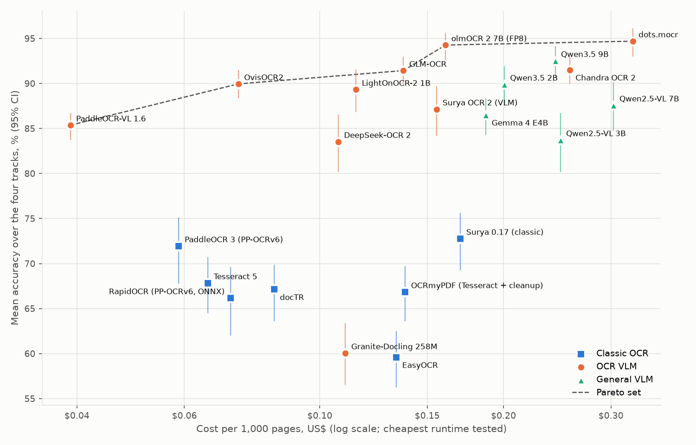
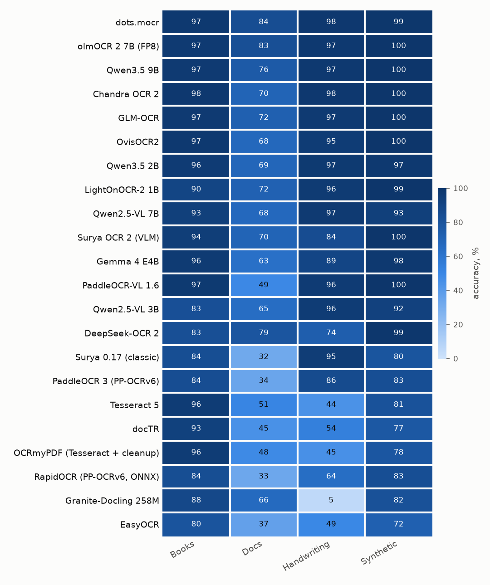
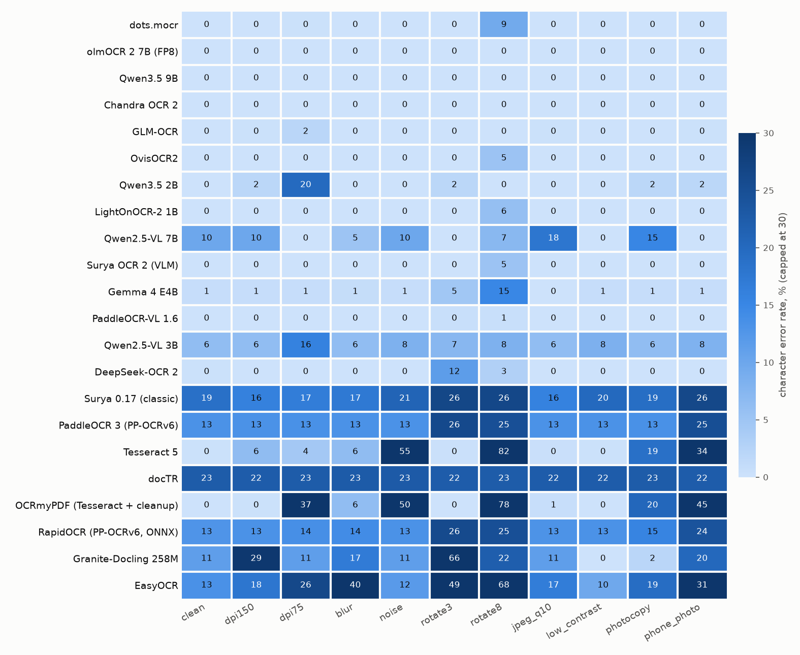
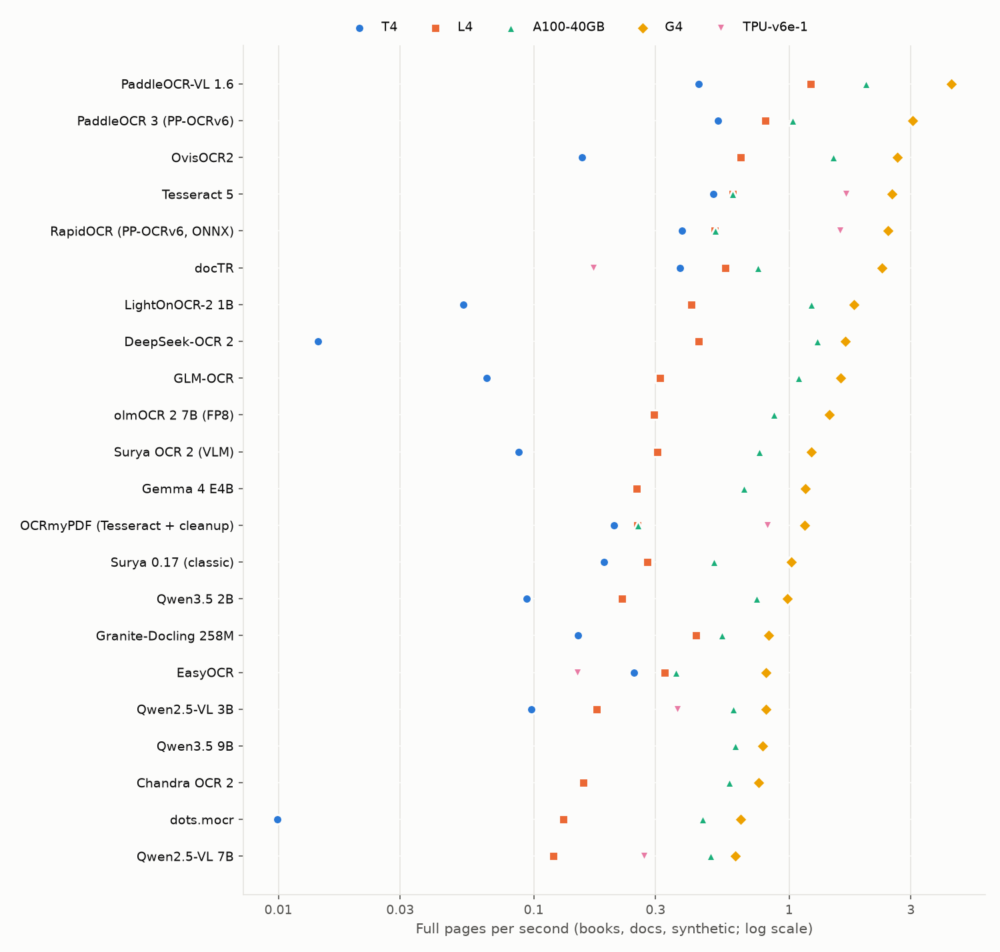

# Open OCR Engines Compared: 22 Engines, Four Kinds of Material, Five Cloud Runtimes

| created | modified | status | confidence | importance |
|---|---|---|---|---|
| 2026-10-05 | 2026-10-05 | finished | likely[^conf] | 4 |

> **Abstract.** Four claims about optical character recognition (OCR) are common in practice: that general-purpose vision-language models (VLMs) can do OCR, that PaddleOCR, dots, and Surya offer a good balance of accuracy and cost at large scale, that mass digitisation needs pipelines built for the material, and that results depend on the type of material. I tested them on 22 open-weight engines (7 classic OCR libraries, 10 OCR-specialised VLMs, and 5 general VLMs) and five Google Colab runtimes (T4, L4, A100-40GB, G4, TPU v6e-1), using four tracks with known answers: 50 pages of historical printed books from the FineBooks ground truth ([Majstorovic & van Strien 2026](#references)), 50 modern PDFs scored with the unit tests of olmOCR-bench ([Poznanski et al 2025a](#references)), 60 handwritten lines from IAM ([Marti & Bunke 2002](#references)), and 55 synthetic pages at eleven levels of degradation. On the one runtime where every engine read every page, mean accuracy over the four tracks ranges from 59.6% (EasyOCR) to 94.7% (dots.mocr, 95% CI 93.0–96.1), followed by olmOCR 2 at 94.3% (92.6–95.6) and a general model, Qwen3.5-9B, at 92.5% (90.6–94.1). On each engine's cheapest runtime, cost ranges from \$0.039 per 1,000 pages (PaddleOCR-VL on an L4) to \$0.326 (dots.mocr on an A100), and five engines form the set for which no other engine is both more accurate and cheaper: PaddleOCR-VL, OvisOCR2, GLM-OCR, olmOCR 2, and dots.mocr. Results depend strongly on material: among the 15 VLMs, the rank order on historical books and on modern documents is almost unrelated (Spearman ρ 0.22), the best engine differs between tracks, and three kinds of failure each changed scores by more than 25 points. Classic engines read the two columns of a nineteenth-century catalogue line by line across both (CER 73–75%), and plain-text prompts produce no tables; two models repeat a decorative header until their token limit; and on handwritten lines Granite-Docling returns no text for 56 of 60 while DeepSeek-OCR 2 replaces some lines with fluent invented sentences. On the nine engines both studies tested, the books results agree in rank order with the FineBooks leaderboard (ρ 0.77). The first claim is supported. The second holds for PaddleOCR-VL; dots.mocr is the most accurate engine rather than a balanced one, and Surya OCR 2 is both less accurate and more expensive than GLM-OCR and OvisOCR2. The third is consistent with the evidence but was not tested directly, and the fourth is supported. For these models an L4 is usually the cheapest runtime per page and the G4 the fastest; a TPU v6e-1 runs Qwen2.5-VL at the G4's single-page speed but costs 25–38% more per page than the cheapest GPU, and recompiles for each new image size, which makes it impractical for inputs of varying size such as handwritten lines. Limitations: samples of 50–60 items per track, whole-page prompts for every model, and one software stack (vLLM 0.30).

## Summary without the terminology

OCR is the step that turns a picture of text into text a computer can search and process. For decades it was done by specialised programs such as Tesseract. In the last two years, AI models that read images and write text, the same kind of model used in modern chat assistants, have been trained to do it as well, and several are free to download and run. This study measured 22 of these programs and models to find which are most accurate, how fast they are, and what they cost on the cloud computers most people can rent.

Each one read four kinds of material with known correct answers: pages from old printed natural-history books (1708–1913), modern PDF documents checked with a set of automatic tests, single lines of English handwriting, and clean printed pages made deliberately worse (blurred, rotated, speckled, photographed at an angle, and so on). Each was run on up to five rented machines: four with graphics processors, from the cheapest Google Colab offers to the most expensive, and one with Google's own AI chip (a TPU).

1. **The AI models are much more accurate than the traditional programs.** Of the 15 AI models, 14 score higher on average than the best traditional program. The best AI model averaged 94.7% correct; the best traditional program, 72.8%. The traditional programs read old books well but fail on handwriting and on page layouts with columns or tables.
2. **A general-purpose AI model does nearly as well as one trained only for reading documents.** Qwen3.5-9B, a general model, came third of 22.
3. **Which program is best depends on the material.** The model that reads old books best is not the one that handles modern documents best, and the order among the AI models on those two kinds of material is almost unrelated. Several failures came from one specific property of the material: a two-column page layout, a decorative page header that made two models repeat themselves until they stopped, and handwritten lines, on which one model wrote nothing and two others added text that was not on the page.
4. **Cost differs by a factor of eight among the good models.** Reading a million pages would cost about \$39 with the cheapest accurate model on the cheapest suitable machine, and about \$326 with the most accurate model. Models a few points less accurate cost between an eighth and a half as much as the most accurate one.
5. **The mid-priced machine is usually the cheapest per page.** The fastest machine read pages 3.6 to 5.3 times faster than the mid-priced one but costs five times as much per hour. The cheapest machine was too slow for most of the AI models. Google's TPU read a full page as fast as the fastest graphics processor, but it slows down sharply when each image has a different size.

Every result that looked wrong was investigated, and §5 reports the cause and the evidence for each. Among them were a program that produced random characters on the newest graphics card, because of a software build that did not support that card; a page that crashed one program on every machine; and the ground truth of one Latin book, which contains characters no program can produce.

## 1. Background

### 1.1 Classic OCR

The classic engines split OCR into stages: find lines or words on the page, then recognise the characters in each. Tesseract, begun at Hewlett-Packard and released as open source in 2005, is the reference open engine ([Smith 2007](#references)). Its version 4 and later recognise each line with an LSTM network, and it runs on a CPU. OCRmyPDF ([Barlow 2026](#references)) wraps Tesseract in a pipeline that straightens, cleans, and rotates each page before recognition and writes a searchable PDF; comparing it with plain Tesseract measures what that image cleanup adds.

Four of the other engines detect text regions with one neural network and recognise them with a second. PaddleOCR's PP-OCR models ([Du et al 2020](#references); [Cui et al 2025a](#references)) are now in their sixth version, PP-OCRv6 ([Zhang et al 2026b](#references); [PaddlePaddle 2026a](#references)), and RapidOCR runs the same models through ONNX Runtime ([RapidAI 2021](#references)). EasyOCR pairs the CRAFT detector ([Baek et al 2019](#references)) with a CRNN recogniser ([Shi et al 2017](#references); [JaidedAI 2024](#references)), and docTR ([Mindee 2021](#references)) was run here with the FAST detector ([Chen et al 2021](#references)) and the PARSeq recogniser ([Bautista & Atienza 2022](#references)). Surya 0.17 ([Paruchuri 2025](#references)) is a line-level OCR toolkit from Datalab, built from the same kind of detection and recognition models.

### 1.2 OCR with vision-language models

A vision-language model reads an image and generates text, one token at a time. Since 2025 several have been trained specifically to transcribe documents. Most are fine-tuned from a general VLM:

| Model | What it is | Notes |
|---|---|---|
| olmOCR 2 ([Poznanski et al 2025a](#references); [Poznanski et al 2025b](#references)) | Qwen2.5-VL-7B ([Bai et al 2025a](#references)) trained with rewards computed from unit tests | Run here in its FP8 version ([AllenAI 2025a](#references)) |
| dots.mocr ([Zheng et al 2026](#references); [rednote 2026](#references)) | Extends the earlier dots.ocr ([rednote 2025](#references)) | In its plain-text mode it omits page headers and footers by design |
| DeepSeek-OCR ([Wei et al 2025](#references)) and DeepSeek-OCR 2 ([Wei et al 2026](#references)) | Compress the page into a small number of visual tokens and decode with a 3-billion-parameter mixture-of-experts language model | |
| PaddleOCR-VL ([Cui et al 2025b](#references)), revised as versions 1.5 ([Cui et al 2026](#references)) and 1.6 ([Zhang et al 2026a](#references); [PaddlePaddle 2026b](#references)) | A 0.9-billion-parameter model | Its official system runs a layout model, PP-DocLayout, first and then the VLM on each region |
| GLM-OCR ([Duan et al 2026](#references); [ZAI 2026](#references)) | | Its SDK also runs layout detection first |
| Chandra OCR 2 ([Datalab 2026a](#references)) and Surya OCR 2 ([Datalab 2026b](#references)) | Datalab's VLMs | Surya OCR 2 is a 650-million-parameter successor to the Surya toolkit |
| LightOnOCR-2 ([Taghadouini et al 2026a](#references); [LightOn 2026](#references)) | A 1-billion-parameter end-to-end model | |
| OvisOCR2 ([Lu et al 2026](#references); [ATH-MaaS 2026](#references)) | A post-trained Qwen3.5-0.8B | Not the earlier Ovis architecture ([Lu et al 2024](#references)) |
| Granite-Docling-258M ([IBM 2025](#references)) | | Writes the DocTags markup of SmolDocling ([Nassar et al 2025](#references)), which a library converts to text |

Five general VLMs were run with the same plain transcription prompt: Qwen3.5 2B and 9B ([Qwen 2026](#references)), Gemma 4 E4B ([Gemma Team et al 2026](#references); [Google 2026a](#references)), and Qwen2.5-VL 3B and 7B ([Bai et al 2025a](#references)). The last two are also the only models in the set that the TPU backend of vLLM supports ([vLLM 2026b](#references)).

### 1.3 Existing evaluations

FineBooks ([Majstorovic & van Strien 2026](#references)) compared open VLMs on historical books. Its ground truth is a set of expert transcriptions of 2,165 pages from six Biodiversity Heritage Library ([BHL 2026](#references)) volumes, made by the IMPACT and BHL-Europe projects and published as `finebooks/bhl-impact-gt` ([FineBooks 2026a](#references)). It scores the character error rate (CER), the Levenshtein edit distance ([Levenshtein 1966](#references)) between output and reference divided by the length of the reference, in two modes: *diplomatic*, which counts the modern "s" written for a printed long s (ſ) as an error, and *reading*, which normalises such differences. dots.mocr scored best in the blog post (97.6% reading accuracy); on the later leaderboard ([FineBooks 2026b](#references)) dots.ocr and dots.mocr are statistically tied, followed by OvisOCR2 and a kraken pipeline with PP-OCRv6. FineBooks does not score throughput, and it excludes handwriting and multi-column layouts.

olmOCR-bench ([Poznanski et al 2025a](#references); [AllenAI 2025b](#references)) scores modern PDFs with 7,010 unit tests rather than a reference transcription. Each test checks one property of the output: that a sentence is present, that a header is absent, that passage A precedes passage B, that a table cell lies under a given heading, or that a formula renders the same way in KaTeX. The score is the mean of the per-category pass rates. IAM ([Marti & Bunke 2002](#references)) is the standard database of English handwriting, and `Teklia/IAM-line` ([Teklia 2024](#references)) distributes it as single lines with transcriptions.

### 1.4 The claims tested

Four claims recur in practitioner advice about choosing an OCR system:

- **C1.** General VLMs (the Qwen and Gemini families are the usual examples) can handle OCR.
- **C2.** PaddleOCR, dots, and Surya offer a good balance of accuracy and cost at large scale.
- **C3.** Mass collections need pipelines targeted to the material.
- **C4.** Results depend on the type of material.

These were the starting point of the benchmark. Two of them name products rather than models. "PaddleOCR" covers both the classic PP-OCR pipeline and PaddleOCR-VL, and "Surya" covers both the classic toolkit and Surya OCR 2, so both versions of each were included.

The criteria by which each claim is judged in §6.1 were written after the runs were complete. They are interpretations, not pre-registered tests, and the verdicts should be read with that in mind. Only open-weight models were tested.[^api]

## 2. Data

Every track was sampled with seed 1234. Pages were rendered or converted to PNG before any engine saw them, so every engine received identical images.

**Historical books** (50 pages; CC-BY 3.0). The FineBooks ground truth holds 2,165 pages from six volumes. After pages with fewer than 200 characters of text (plates and blank pages) were dropped, the sample was stratified by volume, giving 8 or 9 pages from each. Two volumes are in English (*Birds of Great Britain* and *Conchologia Iconica*), one in German, one in French (Cuvier's *Histoire naturelle des poissons*), one in French and German (*Trudy Russkago entomologicheskago obshchestva*), and one in Latin (*Piscium querelae et vindiciae*, 1708). The reference for each page is the volume's own transcription, which keeps the long s and ligatures.

**Modern documents** (50 PDFs; ODC-BY). Ten PDFs were sampled from each of five olmOCR-bench categories (headers and footers, long tiny text, multi-column, old scans, and tables), with all the tests attached to each PDF: 292 category tests, plus one baseline test per page that checks for any output and for repetition at the end. Each PDF was rendered at 2,048 pixels on its longest side, the resolution olmOCR uses for API models. The two mathematics categories were excluded, because their tests render LaTeX with KaTeX in a headless Chromium browser, which the benchmark does not install. The docs score is therefore the text-and-table subset of olmOCR-bench and is not comparable with published overall scores.

**Handwriting** (60 lines; MIT, with IAM's own research terms). Random lines from the 2,915-line test split of `Teklia/IAM-line`, each image 128 pixels high. IAM transcriptions are tokenised ("it 's a good start ."), so the references were detokenised to normal spacing before scoring.

**Synthetic pages** (55 pages). Five base pages were rendered at 300 DPI from public-domain passages (Darwin, Austen, Melville, Lincoln, and some accented French and German): two prose pages, one two-column page, one table, and one invoice. Each was then produced at eleven levels: clean, 150 DPI, 75 DPI, blur, noise, 3° rotation, 8° rotation, JPEG quality 10, low contrast, photocopy, and a simulated phone photograph. The ground truth is the rendered text, so it is exact.

## 3. Method

### 3.1 Engines

All VLMs were served with vLLM 0.30 ([Kwon et al 2023](#references)) and Hugging Face Transformers 5.16 ([Wolf et al 2020](#references)). Prompts, sampling settings, and image sizes were copied from each model card. The settings that differ from vLLM's defaults:

| Engine | Type | Size | Prompt or mode | Settings |
|---|---|---|---|---|
| Tesseract 5 | classic | – | `--oem 1 --psm 3` (LSTM, automatic page segmentation), eng+fra+deu+lat | CPU, one process per core |
| OCRmyPDF 17 | classic | – | Tesseract with `--deskew --clean --rotate-pages`, sidecar text | CPU |
| RapidOCR 3.9 | classic | – | PP-OCRv6 detection and recognition in ONNX Runtime | CPU |
| EasyOCR 1.7 | classic | – | en, fr, de, la | GPU when present |
| docTR 1.1 | classic | – | `fast_base` + `parseq` | GPU when present |
| PaddleOCR 3.7 | classic | – | PP-OCRv6 medium | GPU only[^paddlecpu] |
| Surya 0.17 | classic | – | line OCR | GPU |
| PaddleOCR-VL 1.6 | OCR VLM | 0.96B | `OCR:`, whole page | greedy |
| OvisOCR2 | OCR VLM | 0.85B | the card's Markdown prompt | greedy; repeated tails trimmed as on the card |
| LightOnOCR-2 1B | OCR VLM | 1.0B | image only | temperature 0.2, top-p 0.9, longest side 1,540 px |
| GLM-OCR | OCR VLM | 1.33B | `Text Recognition:` | top-k 1, repetition penalty 1.1 |
| Granite-Docling | OCR VLM | 0.26B | `Convert this page to docling.` | DocTags converted with docling-core |
| dots.mocr | OCR VLM | 3.0B | `prompt_ocr` (plain text) | temperature 0.1 |
| DeepSeek-OCR 2 | OCR VLM | 3.4B | `<|grounding|>Convert the document to markdown.` | n-gram repetition processor from the card |
| Chandra OCR 2 | OCR VLM | 5.3B | the card's HTML prompt | greedy |
| Surya OCR 2 | OCR VLM | 0.69B | full-page HTML mode | greedy |
| olmOCR 2 7B (FP8) | OCR VLM | 8.3B | olmOCR's v4 prompt, text before image | temperature 0.1, longest side 1,288 px |
| Qwen3.5 2B and 9B | general VLM | 2.3B, 9.7B | general prompt[^prompt] | greedy, thinking off |
| Gemma 4 E4B | general VLM | 8B | general prompt | greedy, 1,120 image tokens |
| Qwen2.5-VL 3B and 7B | general VLM | 3.8B, 8.3B | general prompt | greedy, at most 1.0 megapixels |

Two further models are in the registry but were not run by default, to keep each runtime's session within its time and compute budget. Nanonets-OCR2-3B ([Mandal et al 2025](#references)) is a fine-tune of Qwen2.5-VL-3B whose card states no licence, and Qwen3-VL-8B ([Bai et al 2025b](#references)) is the predecessor of Qwen3.5-9B, which was run.

### 3.2 Isolation

The engines need incompatible versions of PyTorch, Transformers, and PaddlePaddle, so each family runs in its own virtual environment: one for the classic engines, one each for Paddle, Surya, and vLLM, and one for vLLM-TPU, which runs on Python 3.12 because vllm-tpu 0.30 publishes builds for Python 3.12 only. Each engine runs in its own process group, which is killed after the engine finishes. This was necessary: in an early run, a vLLM worker process left behind by one model held 12.7 GB of GPU memory and caused every later model to fail. Downloaded model weights are deleted after each model, because the disk of a Colab runtime cannot hold all of them at once.

### 3.3 Hardware

| Runtime | Accelerator | Memory | Host CPUs | Compute units per hour | US\$ per hour |
|---|---|---|---|---|---|
| T4 | Tesla T4 (Turing, no bfloat16) | 15 GB | 8 | 1.19 | 0.119 |
| L4 | L4 (Ada) | 22.5 GB | 12 | 1.71 | 0.171 |
| A100-40GB | A100 (Ampere) | 40 GB | 12 | 5.40 | 0.539 |
| G4 | RTX PRO 6000 Blackwell Server Edition | 95.6 GB | 48 | 8.71 | 0.870 |
| TPU v6e-1 | one TPU v6e chip | 32 GB | 44 | 4.08 | 0.408 |

Colab sells compute units at \$9.99 per 100 ([Google 2026b](#references)). Google does not publish a rate per runtime. The GPU rates are third-party measurements ([McCormick 2024](#references)), and the TPU rate was read from the Colab resources panel during the run.

An engine runs on a runtime only if the runtime has enough accelerator memory for it, supports bfloat16 if the engine needs it, and is supported by the engine's backend. Five engines were therefore skipped on the T4 and one on the L4 for memory (one of the five, Gemma 4, also needs bfloat16), and only Qwen2.5-VL and the CPU engines ran on the TPU.

On the T4, which has no bfloat16, VLMs run in float16. LightOnOCR-2 and Granite-Docling run in float32 there, because in float16 they produce no usable text: in the smoke runs LightOnOCR-2 scored 0% and reached its token limit on every page, and Granite-Docling's card warns that it outputs only exclamation marks ([IBM 2025](#references)).

### 3.4 Measurement

**Accuracy.** For text tracks, accuracy is 1 − CER, with CER computed per page in *reading* mode and capped at 1 per page, then averaged over pages. Reading mode reduces both output and reference to plain text before comparison: Markdown, HTML, LaTeX, and model-specific tokens are stripped, Unicode is normalised with NFKC, the long s is mapped to s, quotation marks and dashes are unified, and words hyphenated at line ends are joined. Unlike FineBooks, it does not fold case. The cap matters because a page on which a model repeats itself to its token limit can have a CER of several units, its output being many times longer than the reference; the cap keeps one such page from outweighing the rest of the sample and counts it as a complete failure. For the docs track, accuracy is olmOCR-bench's score: the pass rate within each test category, then the mean over categories, with the baseline test counted as a sixth category. Two further measures describe failures: the loop rate, the share of pages that end in a repeated sequence or that stopped at the token limit, and the empty rate, the share of pages with no output.

**Speed.** Each engine first reads one page that is not timed (warm-up). Then, on each track, it reads up to eight pages one at a time (latency), and then all pages in batches (throughput). Throughput is reported in full pages per second over the three full-page tracks. Handwriting lines, about one twentieth the size of a page, are reported separately.

**Cost.** Cost per 1,000 pages is the runtime's hourly price divided by its throughput. It counts only time spent reading. Model loading, which took from 0.2 seconds (Tesseract) to 11 minutes (Qwen3.5-2B on a T4), is reported separately, and so is the time spent installing software.

**Time budget.** Each engine on each runtime had a reading budget of 25 minutes, raised to 45 or 60 minutes for the slow-hardware sessions listed in Appendix A. Load time is excluded and has a separate 30-minute allowance. The budget is shared evenly between tracks, time left by a track that finishes early returns to tracks that were cut short, and each batch is sized so that it can finish within the time remaining. An engine that runs out of time is reported as partial, with the number of pages it scored.

**Statistics.** Intervals are 95% percentile bootstraps over pages ([Efron 1979](#references)), 2,000 resamples. For the docs track, pages are resampled and the category pass rates recomputed. The overall interval resamples each track independently. Rank agreement is Spearman's ρ ([Spearman 1904](#references)).

**Suspect results.** A result is marked suspect, and excluded from accuracy and speed tables, if it is more than 25 points below the same engine's best accuracy on the same track on another runtime. A difference that large means the engine is broken on that runtime, not slower or less accurate.

### 3.5 The reference runtime

Accuracy should not depend on hardware, and in this benchmark it did not. Over every complete, unbroken track that ran on more than one runtime, the accuracy of an engine on a track varied across runtimes by a median of 0.04 points; the largest difference is 4.3 points, for Granite-Docling on the synthetic pages. All accuracy figures below therefore come from one runtime, the G4, the only runtime on which all 22 engines read every page with the final version of the code. PaddleOCR's figures come from its rerun after the fix described in §5.1.

## 4. Results

### 4.1 Overall

| # | Engine | Type | Books | Docs | Handwriting | Synthetic | Mean (95% CI) | \$ per 1,000 pages (runtime) |
|---|---|---|---|---|---|---|---|---|
| 1 | dots.mocr | OCR VLM | 97.5 | **84.2** | **98.0** | 99.1 | **94.7** (93.0–96.1) | 0.326 (A100) |
| 2 | olmOCR 2 7B | OCR VLM | 96.8 | 82.9 | 97.4 | 100.0 | 94.3 (92.6–95.6) | 0.161 (L4) |
| 3 | Qwen3.5 9B | general VLM | 96.8 | 76.0 | 97.3 | 100.0 | 92.5 (90.6–94.1) | 0.243 (A100) |
| 4 | Chandra OCR 2 | OCR VLM | **98.0** | 70.3 | 97.7 | **100.0** | 91.5 (90.0–93.0) | 0.257 (A100) |
| 5 | GLM-OCR | OCR VLM | 96.8 | 72.4 | 96.8 | 99.8 | 91.4 (89.9–93.0) | 0.137 (A100) |
| 6 | OvisOCR2 | OCR VLM | 97.3 | 67.6 | 95.3 | 99.5 | 90.0 (88.3–91.5) | 0.074 (L4) |
| 7 | Qwen3.5 2B | general VLM | 95.9 | 69.1 | 97.1 | 97.5 | 89.9 (87.5–91.9) | 0.201 (A100) |
| 8 | LightOnOCR-2 1B | OCR VLM | 89.8 | 71.8 | 96.3 | 99.5 | 89.3 (86.8–91.6) | 0.115 (L4) |
| 9 | Qwen2.5-VL 7B | general VLM | 93.1 | 67.5 | 96.5 | 93.2 | 87.6 (84.8–90.1) | 0.303 (A100) |
| 10 | Surya OCR 2 | OCR VLM | 94.4 | 70.2 | 84.5 | 99.5 | 87.1 (84.2–89.7) | 0.156 (L4) |
| 11 | Gemma 4 E4B | general VLM | 96.2 | 63.0 | 89.2 | 97.6 | 86.5 (84.3–88.4) | 0.187 (L4) |
| 12 | PaddleOCR-VL 1.6 | OCR VLM | 97.0 | 48.8 | 95.8 | 99.9 | 85.4 (83.7–86.7) | **0.039** (L4) |
| 13 | Qwen2.5-VL 3B | general VLM | 82.7 | 64.5 | 95.6 | 92.1 | 83.7 (80.2–86.7) | 0.248 (A100) |
| 14 | DeepSeek-OCR 2 | OCR VLM | 82.9 | 78.9 | 73.6 | 98.7 | 83.5 (80.2–86.6) | 0.107 (L4) |
| 15 | Surya 0.17 | classic | 83.9 | 32.3 | 95.2 | 79.6 | 72.8 (69.3–75.6) | 0.170 (L4) |
| 16 | PaddleOCR 3 (PP-OCRv6) | classic | 84.3 | 34.1 | 85.9 | 83.5 | 71.9 (67.8–75.1) | 0.059 (L4) |
| 17 | Tesseract 5 | classic | 95.7 | 50.7 | 43.9 | 81.0 | 67.8 (64.5–70.7) | 0.066 (T4) |
| 18 | docTR | classic | 92.6 | 44.8 | 53.7 | 77.5 | 67.1 (63.6–69.9) | 0.084 (L4) |
| 19 | OCRmyPDF | classic | 95.7 | 48.3 | 45.0 | 78.4 | 66.8 (63.6–69.7) | 0.138 (TPU) |
| 20 | RapidOCR | classic | 83.7 | 33.4 | 64.2 | 83.3 | 66.2 (62.0–69.6) | 0.071 (TPU) |
| 21 | Granite-Docling 258M | OCR VLM | 87.7 | 66.2 | 4.7 | 81.7 | 60.1 (56.5–63.4) | 0.110 (L4) |
| 22 | EasyOCR | classic | 80.0 | 36.6 | 49.5 | 72.4 | 59.6 (56.2–62.5) | 0.134 (T4) |

Accuracy in %, from the G4 run. Books, handwriting, and synthetic are 1 − CER; docs is the olmOCR-bench pass rate. Cost is on the cheapest runtime tested for each engine, over full pages; for the CPU engines, "TPU" means the TPU runtime's 44-core host. The intervals for every track are in `figures/data.json`.

The first three are not separated: the intervals of dots.mocr, olmOCR 2, and Qwen3.5-9B overlap. The next four (Chandra, GLM-OCR, OvisOCR2, Qwen3.5-2B) form a second group whose intervals overlap each other and the third-placed model. Every VLM except Granite-Docling scores higher on average than every classic engine.



*Figure 1. Mean accuracy over the four tracks (G4 run, 95% bootstrap CI) against cost per 1,000 full pages on each engine's cheapest Colab runtime (log scale). The dashed line joins the Pareto set: engines for which no other engine is both cheaper and more accurate. Data: `figures/data.json`.*

Five engines form the Pareto set (Figure 1): PaddleOCR-VL (\$0.039, 85.4%), OvisOCR2 (\$0.074, 90.0%), GLM-OCR (\$0.137, 91.4%), olmOCR 2 (\$0.161, 94.3%), and dots.mocr (\$0.326, 94.7%). At a million pages these cost \$39, \$74, \$137, \$161, and \$326 of compute. Moving from olmOCR 2 to dots.mocr doubles the cost for a 0.4-point difference that lies within both intervals.

### 4.2 Dependence on material



*Figure 2. Accuracy by track (G4 run), engines in order of mean accuracy. Books, handwriting, and synthetic: 1 − CER; docs: olmOCR-bench pass rate. Data: `figures/data.json`.*

The best engine differs by track: Chandra OCR 2 on books (98.0%), dots.mocr on docs (84.2%) and handwriting (98.0%), and Chandra again on the synthetic pages, with no errors on any of the 55 and olmOCR 2 and Qwen3.5-9B within 0.01 points of it.

Rank agreement between tracks, over all 22 engines, ranges from ρ = 0.50 (books and docs) to 0.76 (handwriting and synthetic). Much of it comes from the separation between classic engines and VLMs. Among the 15 VLMs alone, the order on books and the order on docs are almost unrelated (ρ = 0.22), and the other pairs lie between 0.43 and 0.70. Individual engines show the dependence more directly. PaddleOCR-VL is fourth on books (97.0%) and last of the VLMs on docs (48.8%). DeepSeek-OCR 2 is third on docs (78.9%) and last of the VLMs except Granite-Docling on handwriting (73.6%). Tesseract is within 2.3 points of the best engine on books (95.7%) and scores 43.9% on handwriting, and Surya 0.17, a classic engine, reads handwriting at 95.2%, within 3 points of the best VLM, while scoring 32.3% on docs. The reasons are specific, and §4.3–4.6 identify them.

### 4.3 Historical books

| Engine | de | en | fr | fr+de | la |
|---|---|---|---|---|---|
| Chandra OCR 2 | 1.3 | 0.3 | 1.1 | 0.3 | 9.0 |
| dots.mocr | 0.5 | 1.3 | 3.0 | 0.9 | 8.5 |
| OvisOCR2 | 0.7 | 1.1 | 1.7 | 1.1 | 10.7 |
| PaddleOCR-VL 1.6 | 0.4 | 2.0 | 1.5 | 0.5 | 12.1 |
| Tesseract 5 | 0.4 | 3.7 | 2.1 | 3.0 | 13.1 |
| LightOnOCR-2 1B | 0.6 | 1.4 | 2.5 | 2.1 | **55.7** |
| Surya OCR 2 | 0.4 | 1.0 | 0.9 | 0.2 | **31.0** |
| Qwen2.5-VL 3B | 23.3 | 21.3 | 13.8 | 1.5 | 21.9 |
| DeepSeek-OCR 2 | 2.6 | **28.5** | 5.0 | 2.3 | 33.0 |
| PaddleOCR 3 | 1.8 | **37.2** | 1.3 | 1.1 | 10.5 |
| RapidOCR | 1.8 | **38.1** | 1.8 | 1.7 | 10.8 |
| Surya 0.17 | 0.3 | **37.5** | 1.1 | 0.6 | 14.3 |

Mean page CER (%) by language, G4 run; 8 pages for each of de, fr, fr+de, and la, 18 for en. All 22 engines are in `figures/data.json`.

Three effects account for nearly all the error on this track.

**A two-column layout.** The 18 English pages come from two volumes. On all nine pages of *Conchologia Iconica*, four classic engines have a CER between 70% and 78%, while Tesseract has 6.1% and dots.mocr 0.9%:

| Engine | CER on *Conchologia Iconica* |
|---|---|
| PaddleOCR | 73.8% |
| RapidOCR | 73.4% |
| Surya 0.17 | 74.1% |
| EasyOCR | 74.9% |
| Tesseract | 6.1% |
| dots.mocr | 0.9% |

The pages are set in two columns: a Latin description beside its English translation. RapidOCR's output alternates between them line by line:

```text
Species 370. (Mus. Cuming.)
what rounded, smooth or concentrically striated,
BuLIMUs MERIDIONALIs. Bul. testá ovato-conicá, um-
columella reflected, aperture small, lip simple; pale
bilicatá, tenui, diaphaná, anfractibus septem, obliquè
```

These engines detect text lines and return them in top-to-bottom order without grouping them into columns. Tesseract's page segmentation (`--psm 3`) finds the columns first, which is why it scores 95.7% on books where the others score 84%. Two VLMs are also affected on this volume: DeepSeek-OCR 2 (50.7%) and Qwen2.5-VL-3B (35.8%). FineBooks did not evaluate multi-column layouts ([Majstorovic & van Strien 2026](#references)), so this effect does not appear in its leaderboard.

**Characters no engine can produce.** In the Latin volume, the FineBooks transcription encodes the printer's ligatures as code points from Unicode's Private Use Area, and its Greek quotations as the replacement character U+FFFD. Here is a line from the reference beside dots.mocr's reading of it:

```text
reference:  Ichtyitas reperiri ſcribit Valentinus Prodr.Hi[U+EADA]or. Nat.
dots.mocr:  Ichtyitas reperiri ſcribit Valentinus Prodr. Hiſtor. Nat.
```

On the sampled Latin pages, 3.5% of the reference characters, after normalisation, are of these two kinds. In the French volume the share is 0.2%, and in the other four volumes it is zero. No engine can output a private-use code point that stands for a ligature only in the transcribers' font. Every such character costs at least one edit, and two when the engine writes the two letters the ligature represents. The best engine on Latin pages has a CER of 8.5%, consistent with a floor of 4–7% from the reference alone.

**Repetition on a decorative header.** The running head of the Latin volume is a page number set between printer's ornaments, and two models fail on it. On three of the eight Latin pages, LightOnOCR-2 transcribes the ornaments as LaTeX symbols (`$\mathcal{O} \mathcal{O} \mathcal{O} …`) and repeats them until its 4,096-token limit, a CER of 4.3 to 5.4 before the cap. On a fourth it reads the text correctly, writes the header and a Greek quotation as LaTeX, and appends a paragraph of English commentary on how an image would be embedded in Markdown; that output is three times the length of the 412-character reference (CER 2.2). Surya OCR 2 repeats `&amp;` in the same header on two pages, until its 8,192-token limit. Each of these pages counts as a CER of 1 after the cap. That is why LightOnOCR-2, which is within 2 points of the best engine on every other language, scores 89.8% on books overall.

**Comparison with FineBooks.** The comparison covers the nine engines that both this study and the FineBooks leaderboard ([FineBooks 2026b](#references)) evaluated:

| Engine | FineBooks reading accuracy (2,165 pages) | This study (50 pages, 95% CI) |
|---|---|---|
| dots.mocr | 97.6 | 97.5 (96.6–98.3) |
| OvisOCR2 | 97.0 | 97.3 (96.2–98.3) |
| PaddleOCR-VL 1.6 | 96.1 | 97.0 (95.6–98.1) |
| olmOCR 2 | 95.7 | 96.8 (95.7–97.7) |
| LightOnOCR-2 | 95.1 | 89.8 (81.8–96.1) |
| GLM-OCR | 95.1 | 96.8 (95.8–97.6) |
| Qwen3.5 9B | 94.9 | 96.8 (95.9–97.7) |
| DeepSeek-OCR 2 | 93.8 | 82.9 (74.5–90.5) |
| Tesseract 5 | 93.6 | 95.7 (94.3–97.1) |

The rank orders agree (ρ = 0.77). The two large differences have identified causes. FineBooks excludes pages on which a model loops from its CER and reports them as a separate loop rate, while this study counts them as failures, which accounts for LightOnOCR-2. DeepSeek-OCR 2's score here includes the two-column volume, where its CER is 50.7%, and FineBooks did not evaluate multi-column layouts. The engines that do not fail in these ways score between 0.1 points lower and 2.1 points higher here than on FineBooks. A plausible cause is that FineBooks scores all 2,165 pages, including sparse pages on which it reports that models differ most, while this sample excludes pages with fewer than 200 characters.

### 4.4 Modern documents

| Engine | Baseline | Headers and footers | Long tiny text | Multi-column | Old scans | Tables | Mean |
|---|---|---|---|---|---|---|---|
| dots.mocr | 100 | 95 | 98 | 88 | 37 | 87 | 84.2 |
| olmOCR 2 | 100 | 95 | 93 | 85 | 37 | 87 | 82.9 |
| DeepSeek-OCR 2 | 100 | 95 | 94 | 85 | 14 | 85 | 78.9 |
| Qwen3.5 9B | 100 | 50 | 97 | 91 | 31 | 87 | 76.0 |
| GLM-OCR | 98 | 100 | 94 | 85 | 25 | 32 | 72.4 |
| LightOnOCR-2 | 100 | 18 | 98 | 91 | 37 | 87 | 71.8 |
| Chandra OCR 2 | 100 | 32 | 95 | 77 | 31 | 87 | 70.3 |
| OvisOCR2 | 94 | 14 | 97 | 91 | 23 | 87 | 67.6 |
| Granite-Docling | 94 | 95 | 74 | 68 | 15 | 51 | 66.2 |
| Tesseract 5 | 98 | 41 | 79 | 71 | 15 | 0 | 50.7 |
| PaddleOCR-VL 1.6 | 94 | 23 | 89 | 65 | 23 | 0 | 48.8 |
| PaddleOCR 3 | 98 | 27 | 62 | 6 | 12 | 0 | 34.1 |
| RapidOCR | 98 | 23 | 59 | 6 | 15 | 0 | 33.4 |

Pass rate (%) by olmOCR-bench category, G4 run; 10 PDFs per category. All engines are in `figures/data.json`.

Two categories account for most of the spread.

**Tables.** The table tests check that a cell lies under a heading or beside another cell, which requires the output to contain a table, in Markdown or HTML. Every classic engine outputs plain lines, and PaddleOCR-VL with its whole-page `OCR:` prompt produces no table structure either, so they pass none of these tests. GLM-OCR, whose `Text Recognition:` prompt asks for text, passes 32%. Both models are designed to be run inside a pipeline in which a layout model finds tables and a table prompt reads them ([Cui et al 2025b](#references); [ZAI 2026](#references)). This study ran them on whole pages, which understates what those pipelines achieve on documents with tables; PaddleOCR-VL's docs score of 48.8% is a result for whole-page use, not for the product.

**Headers and footers.** These tests pass only if the page header and footer are *absent* from the output, since olmOCR-bench treats them as content that should not appear in a text extraction. The models trained to omit page furniture pass them: dots.mocr in plain-text mode ([rednote 2026](#references)), olmOCR 2, and DeepSeek-OCR 2 at 95%, as do GLM-OCR at 100% and Granite-Docling at 95%. Models that transcribe everything fail them: OvisOCR2 (14%) and LightOnOCR-2 (18%). LightOnOCR's own report of its olmOCR-bench score leaves this category out ([Taghadouini et al 2026b](#references)). This is a disagreement about the task, not about reading. The books ground truth includes running heads and page numbers, so the same behaviour that passes these tests loses characters on the books track.

**Multi-column.** The two-column failure of §4.3 appears again: PaddleOCR and RapidOCR pass 6% of the reading-order tests, against 71% for Tesseract.

**Old scans.** Old scans are difficult for every engine: no engine passes more than 37% of their tests.

### 4.5 Handwriting

The 60 lines separate the engines more sharply than any other track, from 98.0% (dots.mocr) to 4.7% (Granite-Docling). Eleven VLMs and the classic Surya 0.17 score between 95% and 98%. Four VLMs score well below the rest, each for a different reason, and each was checked against the IAM reference.

Granite-Docling (4.7%) returns no text for 56 of the 60 lines. Its median output is 12 tokens per line, and after conversion from DocTags it contains no text at all. DocTags marks a figure with a `<picture>` element and four location tokens ([Nassar et al 2025](#references)); an element of that kind, with no text written around it, is consistent with the token counts, but the raw outputs were not stored, so this interpretation is an inference. Granite-Docling is trained to convert documents, and its card does not mention handwriting ([IBM 2025](#references)).

DeepSeek-OCR 2 (73.6%) returns no text for 4 lines and has a CER of at least 1 on 8. Where it fails, it writes a fluent sentence that is not on the page:

```text
reference:  simple and coherent plan. To understand how
output:     had been able to achieve their goals, it is necessary to understand how they had achieved them.

reference:  man could only be regarded as a machine.
output:     was could only be required as a valuable.
```

Surya OCR 2 (84.5%) has a CER above 20% on 11 of the 60 lines. On 7 of them it reads the line correctly and then continues with an invented next line, so that its output is more than 1.3 times the length of the reference. On one line the continuation repeats until its token limit, and one line it labels as an image and does not transcribe:

```text
reference:  showing that such changes are part of a
output:     showing that such changes are part of a<br/>series of changes in the same way.
```

Gemma 4 E4B (89.2%) often stops partway through a line ("into themselves," for "into themselves, so that they become").

Apart from Surya 0.17 (95.2%) and PaddleOCR (85.9%), the classic engines score 44–64% on handwriting, and Tesseract, OCRmyPDF, and RapidOCR return nothing for 6 or 7 of the 60 lines. OCRmyPDF also fails on one line, `iam_00023` (1,748 × 128 pixels), with "Tesseract: Error during processing", and does so on all five runtimes (on the A100 during the single-page pass, §5.1). Plain Tesseract reads the same image without error, so the failure is in one of OCRmyPDF's steps before or around Tesseract (deskew, cleaning, or rotation detection on a page 0.43 inches high at 300 DPI); which one was not isolated. The page is scored as a failure.

### 4.6 Degraded pages



*Figure 3. CER (%) by degradation level on the synthetic track, five pages per level, G4 run. Colour is capped at 30%. Data: `figures/data.json`.*

Eleven of the 15 VLMs have a CER below 1% at nine or more of the eleven levels (Figure 3). Their largest errors are concentrated in a few cells:

| Engine | Level | CER |
|---|---|---|
| dots.mocr | 8° rotation | 9% |
| Gemma 4 | 8° rotation | 15% |
| Qwen3.5-2B | 75 DPI | 20% |
| DeepSeek-OCR 2 | 3° rotation | 12% |

The classic engines show the expected pattern. Tesseract is error-free on clean pages and fails on noise (55%), 8° rotation (82%), and the phone photograph (34%). OCRmyPDF, despite its deskew step, is no better on 8° rotation (78%) and is worse at 75 DPI (37%, against 4% for Tesseract); a likely cause of the second is that its cleaning step removes detail from an image that is already of low resolution, which was not isolated. PaddleOCR, RapidOCR, Surya 0.17, and docTR have a nearly constant error of 13–23% at every level, including clean pages, which comes from particular base pages rather than from the degradations. PaddleOCR, RapidOCR, and Surya fail the two-column page (65–66% CER), the layout problem of §4.3; docTR reads the two-column page correctly and fails the table and invoice pages (67% and 44%).

The leaderboard's automatic "most robust" category named Qwen2.5-VL-7B, whose CER is 3.5 points *lower* on degraded pages than on clean ones. That is not robustness. There is one page per layout at each level, and Qwen2.5-VL-7B's errors are on the two-column page (50% CER at five levels, including clean) and the invoice (25% at four). Whether it fails on those pages varies from level to level independently of the degradation. With five pages per level, a difference between clean and degraded pages is reliable only for engines that read the clean pages without error. Among those, Chandra OCR 2 read all 55 pages with no error, and olmOCR 2 and Qwen3.5-9B with CER below 0.01%. These are the most robust engines in this sample.

### 4.7 Speed and cost by runtime



*Figure 4. Throughput in full pages per second (books, docs, synthetic) for every engine on every runtime on which it ran (log scale). Engines in order of throughput on the G4. Data: `figures/data.json`.*

**VLMs.** The G4 is the fastest runtime for every VLM. Relative to the G4:

| Runtime | Range | Typical |
|---|---|---|
| A100 | 0.46–0.80 | |
| L4 | 0.19–0.28 (Granite-Docling 0.52) | about a quarter |
| T4 | 0.01–0.12 (Granite-Docling 0.18) | |

The G4 costs 5.1 times as much per hour as the L4, so for most VLMs the L4 has the lowest cost per page. It is the cheapest runtime for 11 of the 22 engines, the A100 for 7, the T4 and the TPU for 2 each. The A100 is cheapest for Qwen3.5, Chandra, dots.mocr, Qwen2.5-VL, and GLM-OCR. Qwen3.5-9B did not run on the L4; for each of the others, the A100 is 3.4 to 4.2 times as fast as the L4, more than the 3.2 times its price.

**Classic engines.** Throughput follows the number of host CPUs, not the accelerator. Tesseract reads:

| Runtime | Host CPUs | Pages per second |
|---|---|---|
| T4 | 8 | 0.50 |
| L4 | 12 | 0.60 |
| A100 | 12 | 0.60 |
| TPU host | 44 | 1.67 |
| G4 | 48 | 2.53 |

The cheapest runtime for a CPU engine is therefore the one with the lowest price per CPU, which in this set is the T4 or the TPU host.

**The T4.** It is cheap per hour and slow per page for VLMs. It has no bfloat16, and FlashAttention-2, the attention kernel vLLM uses by default on newer GPUs, does not support it ([Dao 2023](#references)). On it, dots.mocr read 0.010 pages per second (\$3.33 per 1,000 pages) and DeepSeek-OCR 2 read 0.014 (\$2.31). For DeepSeek-OCR 2, vLLM's log records that it found no tuned configuration for the mixture-of-experts kernel on the T4 and used a default ("Using default MoE config. Performance might be sub-optimal! Config file not found at … `device_name=Tesla_T4.json`"). PaddleOCR-VL is the only VLM that remains practical on a T4: 0.44 pages per second, \$0.074 per 1,000 pages.

**The TPU v6e-1.** It ran Qwen2.5-VL-3B and -7B through vllm-tpu. For a single full page it matches the G4 exactly: 3.35 seconds per book page for the 3B model on both runtimes. In batches its throughput was 44–45% of the G4's for both models, which puts its cost at \$0.310 per 1,000 pages for the 3B model and \$0.419 for the 7B, 25% and 38% above their cheapest GPU (the A100, at \$0.248 and \$0.303). Its accuracy is the same as on the GPUs: Qwen2.5-VL-3B scored 85.8% on books on the TPU and 82.7–84.2% on the GPUs.

The TPU is slow when inputs vary in size. On handwriting it took 13–21 seconds per line, against 0.1 seconds on the G4, and the 3B and 7B models took the same time per line. Of the eight synthetic pages read one at a time, the two that were slow (18–22 seconds, against 3.1–7.1 for the others) are the first pages of a new size. The cause is compilation: JAX compiles a function separately for each new shape of input ([JAX 2026](#references)). The full pages are similar in size, so few new compilations are needed. Every handwriting line has a different width, so nearly every line triggers one. Padding images to a small set of sizes would remove most of these compilations; it was not tried.

## 5. Failures, skipped runs, and outliers

Every run that failed, was skipped, or produced a value that looked wrong is listed here with its cause and the evidence for it. The sequence of runs and fixes is in Appendix A.

### 5.1 Failures found and fixed

**PaddleOCR on the G4 returned random characters.** On the first G4 run, the classic PaddleOCR engine scored 0% on books, handwriting, and synthetic pages, against 84–86% on every other runtime. Its output was a sequence of unrelated Chinese characters and symbols for an English bird book (`額俞臺姓W逻裔0逮哥戊隶独迈`), and it reported no error. The G4's RTX PRO 6000 is a Blackwell GPU, compute capability 12.0 ([NVIDIA 2026](#references)), which needs CUDA 12.8 or later ([NVIDIA 2025](#references)), and the benchmark had installed PaddlePaddle's CUDA 12.6 build. The CUDA 12.9 build, which Paddle publishes for these GPUs ([PaddlePaddle 2026c](#references); [PaddlePaddle 2026d](#references)), is now installed on any GPU of compute capability 10 or higher, and on rerun PaddleOCR scored 84.3% on books, matching the other runtimes. To catch failures of this kind, the leaderboard now marks any result more than 25 points below the same engine on another runtime as suspect (§3.4).

**Qwen2.5-VL-7B did not start on the L4.** After its weights were loaded, 0.28 GiB of the 22.5 GB was left for the key-value cache, and one request of 8,192 tokens needs 0.44 GiB. Raising vLLM's memory share from 0.85 to 0.92 fixed it.

**Chandra OCR 2 and Qwen2.5-VL-7B on the L4 ran out of time.** In the first L4 run, Chandra spent its 25 minutes on the first three tracks and scored no synthetic pages. The budget is now shared between tracks, and time left over is returned to tracks that were cut short. The rerun, with a 45-minute budget, scored 197 of 215 Chandra items and 195 of 215 for Qwen2.5-VL-7B. Their accuracy figures come from the complete G4 run.

**One batch ran 30 minutes past the budget.** On the T4, a single batch of 32 pages for DeepSeek-OCR 2 took 38 minutes, because the worker checked the clock only between batches. Batches are now sized to fit the time remaining.

**vLLM's prefix cache made repeated pages look fast.** The batch pass begins with the pages the latency pass has just read. vLLM's automatic prefix caching, which reuses the stored computation of a prompt it has already seen, including its image ([vLLM 2026a](#references)), skipped most of the work on those pages. On the T4, dots.mocr read its first four batch pages at 9 seconds each, against 93 seconds for a new page. The worker used that rate to size its next batch, which then took 60 minutes. Prefix caching is now off for every VLM, since every page is new in real use. The runs on the A100, L4, and T4 were made with it on. On the A100 and L4, the first batch of each track, which contained the repeated pages, was not consistently faster per page than the second, which did not: the ratio of second to first ranged from 0.42 to 2.9 with no consistent direction. The effect is therefore within the variation between pages there. On the T4, where reading the image dominates the cost, the throughput of image-heavy models such as dots.mocr is overstated. The G4 and TPU runs were made with it off.

**OCRmyPDF lost its handwriting track on the A100.** The failing line `iam_00023` (§4.5) occurred during the latency pass, which did not then catch errors page by page, so the whole track was lost. The latency pass now handles a failed page like the batch pass does. OCRmyPDF's handwriting score comes from later runs.

### 5.2 Skipped runs

| Runtime | Engines skipped | Reason |
|---|---|---|
| T4 (15 GB) | Chandra OCR 2, olmOCR 2, Qwen3.5-9B, Qwen2.5-VL-7B, Gemma 4 E4B | Need more memory than the T4 has (20–30 GB with room for a working cache); Gemma 4 also needs bfloat16, which the T4 lacks |
| L4 (22.5 GB) | Qwen3.5-9B | Needs 30 GB |
| TPU v6e-1 | every VLM except Qwen2.5-VL, plus PaddleOCR and Surya | Not supported by the TPU backend ([vLLM 2026b](#references)), or need a CUDA GPU |
| TPU v5e-1 | everything | Not run (below) |

The TPU v6e-1 runtime ran the five CPU engines on its 44-core host, and Qwen2.5-VL 3B and 7B on the TPU. The TPU backend's support table lists Qwen3.5-9B and Qwen3-VL-8B as untested and Gemma 4 E4B as passing its release tests. Running Gemma 4 on the TPU is the first addition to make in further work.

The TPU v5e-1 was planned and not run. The Colab account's compute units were exhausted after the v6e-1 run; these runs used about 70. The v5e-1 has 16 GB of memory, so it would have run only the CPU engines and Qwen2.5-VL-3B, which the v6e-1 run already measured.

### 5.3 Values that look wrong and are not

- **Granite-Docling at 4.7% on handwriting, DeepSeek-OCR 2 at 73.6%, Surya OCR 2 at 84.5%, and Gemma 4 at 89.2%:** behaviour of the models, consistent across every runtime (§4.5).
- **LightOnOCR-2 at 89.8% on books:** three pages on which it repeats until its token limit, and one on which it appends commentary (§4.3).
- **Four classic engines at 70–78% CER on one English book:** a two-column layout (§4.3).
- **A floor of about 7% CER on the Latin volume:** characters in the reference that no engine can produce (§4.3).
- **PaddleOCR-VL at 48.8% on docs:** no table output from a whole-page prompt (§4.4).
- **A "most robust" engine whose error falls with degradation:** sampling variation with one page per layout and level (§4.6).
- **Throughput collapsing near the end of a handwriting track,** for example Surya OCR 2 from 56.7 to 3.8 lines per second on the G4: one line on which the model repeats until its token limit. That single line produces 8,192 tokens (Surya OCR 2) or 4,096 (Qwen2.5-VL-7B), as many as 200 normal lines. Surya OCR 2 does this on one line in each of its four runs, and Qwen2.5-VL-7B in three of its four.
- **Peak GPU memory of about 82 GB for every VLM on the G4:** vLLM reserves a fixed share of the GPU's memory at start-up, 85% by default. The figure measures that reservation, not what each model needs, and is not reported in the tables.

## 6. Discussion

### 6.1 Verdicts

| Claim | Criterion (written after the runs) | Result | Verdict |
|---|---|---|---|
| C1. General VLMs can handle OCR | The 95% intervals of the best general VLM and the best OCR-specialised VLM on mean accuracy overlap | Qwen3.5-9B 92.5% (90.6–94.1) against dots.mocr 94.7% (93.0–96.1); within two points on books, handwriting, and synthetic, eight points lower on docs. Qwen3.5-2B is seventh of 22 | **Supported**, for open models of 2–9B parameters. API models such as Gemini were not tested |
| C2. PaddleOCR, dots, and Surya balance accuracy and cost at scale | The engine is in the Pareto set of Figure 1 | PaddleOCR-VL is the cheapest engine and on the set; dots.mocr is on the set as its most accurate and most expensive point; Surya OCR 2 (87.1%, \$0.156) is less accurate and more expensive than both GLM-OCR (91.4%, \$0.137) and OvisOCR2 (90.0%, \$0.074); classic PaddleOCR and Surya 0.17 are below every VLM but one | **Partly supported:** true of PaddleOCR-VL, not of dots.mocr (the most accurate rather than balanced) or Surya |
| C3. Mass collections need targeted pipelines | Not testable as stated: no pipeline was built | Every large failure was specific to the material and to how the engine was used (two columns, tables under plain-text prompts, a decorative header, handwritten lines), and the two engines whose official systems include a layout stage lost most on the tests that stage addresses | **Consistent with the evidence; not tested** |
| C4. Results depend on material type | Rank agreement between tracks is low, or the best engine differs by track | Among VLMs, ρ = 0.22 between books and docs; three different track winners; single engines differ by up to 63 points between tracks (Surya 0.17: 95.2% on handwriting, 32.3% on docs) | **Supported** |

### 6.2 What to use

These recommendations follow from the results on this sample, and should be checked on a sample of the reader's own material before a large run.

- **Historical printed books in Latin script.** OvisOCR2 and PaddleOCR-VL read them at 97% for \$0.04–0.07 per 1,000 pages on an L4; Chandra OCR 2 and dots.mocr score up to 0.7 points higher, at 3.5 to 8.4 times the cost. Tesseract on a CPU reads them at 95.7%, and its page segmentation handles two-column pages, which the other classic engines do not. Any engine should be checked for repetition on decorative headers, and no engine can read the Latin volume of the FineBooks ground truth without error.
- **Modern PDFs with tables and columns.** dots.mocr or olmOCR 2 (84% and 83% of the tests), or DeepSeek-OCR 2 (79%) at a third of the cost of dots.mocr. A plain-text prompt produces no tables, so PaddleOCR-VL and GLM-OCR should be used with their layout pipelines for such documents. Whether headers and footers should be kept is a decision about the task, and the models differ in what they do by default.
- **Handwritten lines in English.** Eleven VLMs and the classic Surya 0.17 score 95–98%. Granite-Docling, DeepSeek-OCR 2, Surya OCR 2, and Gemma 4 should not be used for handwriting without further testing.
- **Badly degraded scans.** olmOCR 2, Chandra OCR 2, or Qwen3.5-9B, which made essentially no errors on any of the 55 synthetic pages.
- **No GPU.** Tesseract is the most accurate CPU engine (67.8% mean, 95.7% on books), and its speed scales with the number of cores.
- **Hardware.** An L4 is the cheapest runtime per page for most VLMs, an A100 for the largest. A G4 finishes a job 3.6 to 5.3 times faster than an L4 at a similar or slightly higher cost per page. A T4 is practical only for PaddleOCR-VL and the classic engines. A TPU v6e-1 costs 25–38% more than the cheapest GPU for full pages of similar size, and is impractical for inputs of varying size without padding.

### 6.3 Threats to validity

- **Small samples.** 50–60 items per track gives 95% intervals about 2 points wide for the best engines on books, handwriting, and synthetic, and about 12 points wide on docs. Most differences among the top seven engines are within these intervals.
- **The books track is six volumes.** With 8 or 9 pages from each, one volume with an unusual property, the two-column *Conchologia Iconica* or the Latin volume with its ornaments and private-use characters, moves an engine's score by several points. The comparison with FineBooks, which scores all 2,165 pages, agrees in rank order.
- **Whole-page prompts.** Every VLM was run on whole pages with one prompt. PaddleOCR-VL and GLM-OCR are designed to run behind a layout model, and dots.mocr, Chandra, and Surya OCR 2 have layout modes that were not used. The results describe whole-page use.
- **One docs subset.** The mathematics categories, which hold 48% of olmOCR-bench's tests, were excluded.
- **Different conventions in the ground truth.** Books references include page furniture, which the docs tests penalise, and the reading normalisation does not fold case, where FineBooks does. Both choices affect engines differently.

- **Training data.** IAM and olmOCR-bench are public, and the synthetic pages use famous public-domain passages. Some models may have seen them during training. A model that has memorised Darwin's opening paragraph could reproduce it from a page it cannot read, so the synthetic track may overstate robustness for such models. The FineBooks ground truth was published in August 2026, after most of these models were released, although the books themselves are available as page images and earlier OCR.
- **Sampling.** LightOnOCR-2, dots.mocr, and olmOCR 2 use temperatures of 0.1–0.2 as their cards recommend. Seeds are fixed, but these results can vary slightly between runs.
- **Prices.** Compute-unit rates come from a third party and from the Colab interface, and change over time. Costs exclude model loading, up to 11 minutes per model, and software installation, which are fixed costs per session. The relative costs between runtimes are more reliable than the absolute amounts.
- **One software version.** All VLMs ran on vLLM 0.30. Speed on the T4 in particular depends on kernels that later versions may tune.

## 7. Further work

1. Run PaddleOCR-VL, GLM-OCR, and dots.mocr with their layout pipelines on the docs track, to measure what the layout stage adds on tables and columns.
2. Pad images to a small set of sizes on the TPU, and run Gemma 4 E4B there, to see whether the TPU's cost per page approaches the GPUs' for varying inputs.
3. Score the books track on all 2,165 FineBooks pages with this harness, to separate the effects of sample and of scoring conventions in the comparison of §4.3.
4. Add the mathematics categories of olmOCR-bench, by installing Chromium and KaTeX in the notebook.
5. Measure handwriting on full pages rather than single lines, where layout and reading order also matter.

## 8. Reproduction

- **Code, data preparation, and results:** [github.com/kvenanzi/ocr](https://github.com/kvenanzi/ocr). The notebook `notebooks/ocr_benchmark_colab.ipynb` runs the benchmark on any Colab runtime and pushes the results to the repository; `results/runs/` holds every run, with its predictions, timings, page scores, and code version (in `env.json`); and `results/LEADERBOARD.md` is the automatically generated leaderboard.
- **Every number and figure in this post.** `tools/post_analysis.py` regenerates them from `results/runs/` into `docs/post/figures/`, including `data.json`.
- **Software.** vLLM 0.30.0, Transformers 5.16, PaddlePaddle 3.3.1, PaddleOCR 3.7.0, surya-ocr 0.17.1, Tesseract 5.3.4, OCRmyPDF 17.13, vllm-tpu 0.30.0.

## Appendix A: Experiment log

All times UTC. Commit hashes refer to [github.com/kvenanzi/ocr](https://github.com/kvenanzi/ocr).

- **2026-10-02, T4 smoke runs** (`20261002-155540_T4_smoke` at `9d4518b`; `20261002-182556_T4_smoke` at `9d82c67`). Four to eleven pages per track, to test the pipeline. The fixes, in commits `b9f28a1` through `a2de873`: virtual environments are created with `uv venv --seed`, because Colab's Python lacks `ensurepip`; each engine runs in its own process group, which is killed afterwards, after a vLLM worker process left over from one model held 12.7 GB and caused every later model to fail; Transformers is pinned below 5.17, which removed a class vLLM 0.30 imports; OCRmyPDF is called through the engine's own Python; the reading-time budget is separated from model loading; fatal GPU errors stop the engine instead of scoring empty pages; and LightOnOCR-2 and Granite-Docling run in float32 on the T4.

- **2026-10-02 19:55, A100-40GB** (`20261002-195503_A100-40GB_standard`, `6cbf41e`). 22 engines; 21 complete. OCRmyPDF lost its handwriting track to the latency-pass error of §5.1, fixed in `721b3c7`.
- **2026-10-02 23:19, L4** (`20261002-231955_L4_standard`, `721b3c7`). 20 engines (Qwen3.5-9B skipped for memory). Two problems, fixed in `4864247`: Chandra OCR 2 scored no synthetic pages (time budget), and Qwen2.5-VL-7B did not start (key-value cache).
- **2026-10-03 14:07, L4 rerun of those two** (`20261003-140718_L4_standard`, `4864247`, 45-minute budget). Both partial: the documents track was cut by its even share of time while later tracks finished early. Time is now returned to tracks that were cut short (`c38110c`).
- **2026-10-03 16:33, T4 session A** (`20261003-163357_T4_standard`, `c38110c`, 60-minute budget). Eleven engines. DeepSeek-OCR 2 read 0.014 pages per second, and one batch exceeded the budget by 30 minutes. Batches are now sized to the time left (`670efe5`).
- **2026-10-03 21:46, T4 session B** (`20261003-214642_T4_standard`, `670efe5`, 60-minute budget). Six engines; five complete. dots.mocr scored 36 pages because of the prefix-cache effect of §5.1. Prefix caching off and batch size taken from the slower of the single-page and batch rates in `2e32d5b`.
- **2026-10-04 16:36, G4** (`20261004-163611_G4_standard`, `089ae28`). All 22 engines complete. PaddleOCR returned random characters (CUDA 12.6 build on Blackwell). CUDA 12.9 build and the suspect-result rule added in `e69582d`.
- **2026-10-04 19:33, G4 rerun of PaddleOCR** (`20261004-193333_G4_standard`, `629016e`). Complete; accuracy matches the other runtimes.
- **2026-10-04 20:57, TPU v6e-1** (`20261004-205730_TPU-v6e-1_standard`, `e4603b5`). Three CPU engines complete. The vllm-tpu environment failed to install, because vllm-tpu 0.30 has no build for Python 3.13. EasyOCR and docTR had been excluded from TPU hosts. Both fixed in `be36579`: Python 3.12 for the TPU environment, and EasyOCR and docTR allowed on the TPU host. The notebook's package installation also failed on this image, because its package index was out of date (`fa39bea`).
- **2026-10-05 14:04, TPU v6e-1 rerun** (`20261005-140416_TPU-v6e-1_standard`, `be36579`). EasyOCR, docTR, and Qwen2.5-VL 3B and 7B; Qwen2.5-VL-7B partial (59 of 60 handwriting lines). The account's compute units were exhausted after this run.

## Appendix B: Decisions

| Decision | Reason |
|---|---|
| Open-weight models only | The question was what can be run on rented hardware without per-page fees |
| Accuracy from one reference runtime, the G4 | It is the only runtime on which every engine read every page with the final code; accuracy differed across runtimes by a median of 0.04 points |
| Page CER capped at 1 and looped pages included | A loop is a failure a user would see; excluding it, as FineBooks does, hides it |
| Reading mode, case not folded | Measures whether the words were read, while keeping capitalisation, which a transcription should preserve |
| Prompts and sampling from each model card | Each model is measured as its authors recommend using it |
| Whole-page prompts for every VLM | One procedure for all models. It understates models built for layout pipelines (§6.3) |
| olmOCR-bench without its mathematics categories | Scoring them needs a headless browser and KaTeX in the notebook |
| Throughput over full pages only | A handwriting line is about one twentieth of a page and would inflate pages per second |
| Cost from reading time only | Loading and installation are fixed per session and do not scale with the number of pages |
| Time budget shared between tracks, with leftover time returned | A slow engine still gets a sample of every track |
| Prefix caching off | Every page is new in real use; the cache made repeated pages appear fast |
| Results more than 25 points below another runtime marked suspect | A difference that large comes from a broken build, as the G4 PaddleOCR run showed |
| One environment and process group per engine family | Incompatible dependencies, and GPU memory held by leftover processes |
| Engines skipped by memory, bfloat16, and backend support | A model that cannot run on a runtime is reported as skipped, not as a failure |

## References

- AllenAI (2025a). "olmOCR-2-7B-1025-FP8". *Hugging Face model card*. [huggingface.co/allenai/olmOCR-2-7B-1025-FP8](https://huggingface.co/allenai/olmOCR-2-7B-1025-FP8)
- AllenAI (2025b). "olmOCR-bench". *Hugging Face dataset card*. [huggingface.co/datasets/allenai/olmOCR-bench](https://huggingface.co/datasets/allenai/olmOCR-bench)
- ATH-MaaS (2026). "OvisOCR2". *Hugging Face model card*. [huggingface.co/ATH-MaaS/OvisOCR2](https://huggingface.co/ATH-MaaS/OvisOCR2)
- Baek Y, Lee B, Han D, Yun S, Lee H (2019). "Character Region Awareness for Text Detection". *CVPR 2019*, pp. 9357–9366. [doi:10.1109/CVPR.2019.00959](https://doi.org/10.1109/CVPR.2019.00959)
- Bai S, Chen K, Liu X, Wang J, Ge W, Song S, Dang K, Wang P, Wang S, Tang J, et al (2025a). "Qwen2.5-VL Technical Report". *arXiv preprint arXiv:2502.13923*. [arxiv.org/abs/2502.13923](https://arxiv.org/abs/2502.13923)
- Bai S, Cai Y, Chen R, Chen K, Chen X, Cheng Z, Deng L, Ding W, Gao C, Ge C, et al (2025b). "Qwen3-VL Technical Report". *arXiv preprint arXiv:2511.21631*. [arxiv.org/abs/2511.21631](https://arxiv.org/abs/2511.21631)
- Barlow JR (2026). "OCRmyPDF". *GitHub repository* (v17). [github.com/ocrmypdf/OCRmyPDF](https://github.com/ocrmypdf/OCRmyPDF)
- Bautista D, Atienza R (2022). "Scene Text Recognition with Permuted Autoregressive Sequence Models". *ECCV 2022 (LNCS 13688)*, pp. 178–196. [doi:10.1007/978-3-031-19815-1_11](https://doi.org/10.1007/978-3-031-19815-1_11)
- BHL (2026). "Biodiversity Heritage Library". *Website*. [biodiversitylibrary.org](https://www.biodiversitylibrary.org/)
- Chen Z, Wang J, Wang W, Chen G, Xie E, Luo P, Lu T (2021). "FAST: Faster Arbitrarily-Shaped Text Detector with Minimalist Kernel Representation". *arXiv preprint arXiv:2111.02394*. [arxiv.org/abs/2111.02394](https://arxiv.org/abs/2111.02394)
- Cui C, Sun T, Lin M, Gao T, Zhang Y, Liu J, Wang X, Zhang Z, Zhou C, Liu H, et al (2025a). "PaddleOCR 3.0 Technical Report". *arXiv preprint arXiv:2507.05595*. [arxiv.org/abs/2507.05595](https://arxiv.org/abs/2507.05595)
- Cui C, Sun T, Liang S, Gao T, Zhang Z, Liu J, Wang X, Zhou C, Liu H, Lin M, et al (2025b). "PaddleOCR-VL: Boosting Multilingual Document Parsing via a 0.9B Ultra-Compact Vision-Language Model". *arXiv preprint arXiv:2510.14528*. [arxiv.org/abs/2510.14528](https://arxiv.org/abs/2510.14528)
- Cui C, Sun T, Liang S, Gao T, Zhang Z, Liu J, Wang X, Zhou C, Liu H, Lin M, et al (2026). "PaddleOCR-VL-1.5: Towards a Multi-Task 0.9B VLM for Robust In-the-Wild Document Parsing". *arXiv preprint arXiv:2601.21957*. [arxiv.org/abs/2601.21957](https://arxiv.org/abs/2601.21957)
- Dao T (2023). "FlashAttention-2: Faster Attention with Better Parallelism and Work Partitioning". *arXiv preprint arXiv:2307.08691 (ICLR 2024)*. [arxiv.org/abs/2307.08691](https://arxiv.org/abs/2307.08691)
- Datalab (2026a). "Chandra OCR 2". *Hugging Face model card*. [huggingface.co/datalab-to/chandra-ocr-2](https://huggingface.co/datalab-to/chandra-ocr-2)
- Datalab (2026b). "Surya OCR 2". *Hugging Face model card*. [huggingface.co/datalab-to/surya-ocr-2](https://huggingface.co/datalab-to/surya-ocr-2)
- Du Y, Li C, Guo R, Yin X, Liu W, Zhou J, Bai Y, Yu Z, Yang Y, Dang Q, Wang H (2020). "PP-OCR: A Practical Ultra Lightweight OCR System". *arXiv preprint arXiv:2009.09941*. [arxiv.org/abs/2009.09941](https://arxiv.org/abs/2009.09941)
- Duan S, Xue Y, Wang W, Su Z, Liu H, Yang S, Gan G, Wang G, Wang Z, Yan S, et al (2026). "GLM-OCR Technical Report". *arXiv preprint arXiv:2603.10910*. [arxiv.org/abs/2603.10910](https://arxiv.org/abs/2603.10910)
- Efron B (1979). "Bootstrap Methods: Another Look at the Jackknife". *The Annals of Statistics* 7(1):1–26. [doi:10.1214/aos/1176344552](https://doi.org/10.1214/aos/1176344552)
- FineBooks (2026a). "FineBooks BHL IMPACT Ground Truth". *Hugging Face dataset card*. [huggingface.co/datasets/finebooks/bhl-impact-gt](https://huggingface.co/datasets/finebooks/bhl-impact-gt)
- FineBooks (2026b). "BHL OCR Leaderboard". *Hugging Face Space*. [huggingface.co/spaces/finebooks/bhl-ocr-leaderboard](https://huggingface.co/spaces/finebooks/bhl-ocr-leaderboard)
- Gemma Team, El Abd S, Aggarwal V, Algayres R, Andreev A, Bachem O, Ballantyne I, Brick C, Cărbune V, Casbon M, et al (2026). "Gemma 4 Technical Report". *arXiv preprint arXiv:2607.02770*. [arxiv.org/abs/2607.02770](https://arxiv.org/abs/2607.02770)
- Google (2026a). "Gemma 4 E4B Instruction-Tuned". *Hugging Face model card*. [huggingface.co/google/gemma-4-E4B-it](https://huggingface.co/google/gemma-4-E4B-it)
- Google (2026b). "Colab Paid Services Pricing". *Google Colaboratory*. [colab.research.google.com/signup](https://colab.research.google.com/signup)
- IBM (2025). "granite-docling-258M". *Hugging Face model card*. [huggingface.co/ibm-granite/granite-docling-258M](https://huggingface.co/ibm-granite/granite-docling-258M)
- JaidedAI (2024). "EasyOCR". *GitHub repository* (v1.7.2). [github.com/JaidedAI/EasyOCR](https://github.com/JaidedAI/EasyOCR)
- JAX (2026). "JAX – The Sharp Bits". *JAX documentation*. [docs.jax.dev/en/latest/notebooks/Common_Gotchas_in_JAX.html](https://docs.jax.dev/en/latest/notebooks/Common_Gotchas_in_JAX.html)
- Kesselman RF (2008). "Verbal Probability Expressions in National Intelligence Estimates: A Comprehensive Analysis of Trends from the Fifties through Post 9/11". *M.S. thesis, Mercyhurst College*. [files.ethz.ch/isn/55739/kesselman_thesis_final.pdf](https://files.ethz.ch/isn/55739/kesselman_thesis_final.pdf)
- Kwon W, Li Z, Zhuang S, Sheng Y, Zheng L, Yu CH, Gonzalez JE, Zhang H, Stoica I (2023). "Efficient Memory Management for Large Language Model Serving with PagedAttention". *Proceedings of the 29th Symposium on Operating Systems Principles (SOSP '23)*:611–626. [doi:10.1145/3600006.3613165](https://doi.org/10.1145/3600006.3613165)
- Levenshtein VI (1966). "Binary codes capable of correcting deletions, insertions, and reversals". *Soviet Physics Doklady* 10(8):707–710. [mathnet.ru/eng/dan31411](https://www.mathnet.ru/eng/dan31411)
- LightOn (2026). "LightOnOCR-2-1B". *Hugging Face model card*. [huggingface.co/lightonai/LightOnOCR-2-1B](https://huggingface.co/lightonai/LightOnOCR-2-1B)
- Lu S, Li Y, Chen QG, Xu Z, Luo W, Zhang K, Ye HJ (2024). "Ovis: Structural Embedding Alignment for Multimodal Large Language Model". *arXiv preprint arXiv:2405.20797*. [arxiv.org/abs/2405.20797](https://arxiv.org/abs/2405.20797)
- Lu S, Li Y, Xia Y, Chen Y, Ji AY, Jiang JP, Chen QG, Zhao J, Lin E, Li H, et al (2026). "OvisOCR2 Technical Report". *arXiv preprint arXiv:2607.13639*. [arxiv.org/abs/2607.13639](https://arxiv.org/abs/2607.13639)
- Majstorovic S, van Strien D (2026). "FineBooks: are open OCR models good enough to unlock historical knowledge?". *Hugging Face blog*. [huggingface.co/blog/finebooks/historical-books-ocr-leaderboard](https://huggingface.co/blog/finebooks/historical-books-ocr-leaderboard)
- Mandal S, Talewar A, Thakuria S, Ahuja P, Juvatkar P (2025). "Nanonets-OCR2". *Hugging Face model card*. [huggingface.co/nanonets/Nanonets-OCR2-3B](https://huggingface.co/nanonets/Nanonets-OCR2-3B)
- Marti UV, Bunke H (2002). "The IAM-database: an English sentence database for offline handwriting recognition". *International Journal on Document Analysis and Recognition* 5(1):39–46. [doi:10.1007/s100320200071](https://doi.org/10.1007/s100320200071)
- McCormick C (2024). "Colab GPUs Features & Pricing". *mccormickml.com (updated March 2026)*. [mccormickml.com/2024/04/23/colab-gpus-features-and-pricing/](https://mccormickml.com/2024/04/23/colab-gpus-features-and-pricing/)
- Mindee (2021). "docTR: Document Text Recognition". *GitHub repository*. [github.com/mindee/doctr](https://github.com/mindee/doctr)
- Nassar A, Marafioti A, Omenetti M, Lysak M, Livathinos N, Auer C, Morin L, Teixeira de Lima R, Kim Y, Gurbuz AS, et al (2025). "SmolDocling: An ultra-compact vision-language model for end-to-end multi-modal document conversion". *arXiv preprint arXiv:2503.11576*. [arxiv.org/abs/2503.11576](https://arxiv.org/abs/2503.11576)
- NVIDIA (2025). "CUDA Toolkit 12.8 Release Notes". *NVIDIA CUDA documentation*. [docs.nvidia.com/cuda/archive/12.8.0/cuda-toolkit-release-notes](https://docs.nvidia.com/cuda/archive/12.8.0/cuda-toolkit-release-notes/index.html)
- NVIDIA (2026). "CUDA GPU Compute Capability". *NVIDIA Developer*. [developer.nvidia.com/cuda-gpus](https://developer.nvidia.com/cuda-gpus)
- PaddlePaddle (2026a). "PaddleOCR v3.7.0 release notes: Release PP-OCRv6". *GitHub release*. [github.com/PaddlePaddle/PaddleOCR/releases/tag/v3.7.0](https://github.com/PaddlePaddle/PaddleOCR/releases/tag/v3.7.0)
- PaddlePaddle (2026b). "PaddleOCR-VL-1.6". *Hugging Face model card*. [huggingface.co/PaddlePaddle/PaddleOCR-VL-1.6](https://huggingface.co/PaddlePaddle/PaddleOCR-VL-1.6)
- PaddlePaddle (2026c). "Install on Linux via PIP". *PaddlePaddle documentation*. [paddlepaddle.org.cn/documentation/docs/en/install/pip/linux-pip_en.html](https://www.paddlepaddle.org.cn/documentation/docs/en/install/pip/linux-pip_en.html)
- PaddlePaddle (2026d). "PaddleOCR-VL NVIDIA Blackwell-Architecture GPUs Usage Tutorial". *PaddleOCR documentation*. [paddleocr.ai](https://www.paddleocr.ai/latest/en/version3.x/pipeline_usage/PaddleOCR-VL-NVIDIA-Blackwell.html)
- Paruchuri V, Datalab Team (2025). "Surya: A lightweight document OCR and analysis toolkit". *GitHub repository*. [github.com/datalab-to/surya](https://github.com/datalab-to/surya)
- Poznanski J, Rangapur A, Borchardt J, Dunkelberger J, Huff R, Lin D, Wilhelm C, Lo K, Soldaini L (2025a). "olmOCR: Unlocking Trillions of Tokens in PDFs with Vision Language Models". *arXiv preprint arXiv:2502.18443*. [arxiv.org/abs/2502.18443](https://arxiv.org/abs/2502.18443)
- Poznanski J, Soldaini L, Lo K (2025b). "olmOCR 2: Unit Test Rewards for Document OCR". *arXiv preprint arXiv:2510.19817*. [arxiv.org/abs/2510.19817](https://arxiv.org/abs/2510.19817)
- Qwen (2026). "Qwen3.5: Towards Native Multimodal Agents". *Qwen blog*. [qwen.ai/blog?id=qwen3.5](https://qwen.ai/blog?id=qwen3.5)
- RapidAI (2021). "RapidOCR: OCR Toolbox". *GitHub repository*. [github.com/RapidAI/RapidOCR](https://github.com/RapidAI/RapidOCR)
- rednote (2025). "dots.ocr". *Hugging Face model card*. [huggingface.co/rednote-hilab/dots.ocr](https://huggingface.co/rednote-hilab/dots.ocr)
- rednote (2026). "dots.mocr". *Hugging Face model card*. [huggingface.co/dots-studio/dots.mocr](https://huggingface.co/dots-studio/dots.mocr)
- Shi B, Bai X, Yao C (2017). "An End-to-End Trainable Neural Network for Image-Based Sequence Recognition and Its Application to Scene Text Recognition". *IEEE Transactions on Pattern Analysis and Machine Intelligence* 39(11):2298–2304. [doi:10.1109/TPAMI.2016.2646371](https://doi.org/10.1109/TPAMI.2016.2646371)
- Smith R (2007). "An Overview of the Tesseract OCR Engine". *Ninth International Conference on Document Analysis and Recognition (ICDAR 2007)* 2:629–633. [doi:10.1109/ICDAR.2007.4376991](https://doi.org/10.1109/ICDAR.2007.4376991)
- Spearman C (1904). "The Proof and Measurement of Association between Two Things". *The American Journal of Psychology* 15(1):72–101. [doi:10.2307/1412159](https://doi.org/10.2307/1412159)
- Taghadouini S, Cavaillès A, Aubertin B (2026a). "LightOnOCR: A 1B End-to-End Multilingual Vision-Language Model for State-of-the-Art OCR". *arXiv preprint arXiv:2601.14251*. [arxiv.org/abs/2601.14251](https://arxiv.org/abs/2601.14251)
- Taghadouini S, Cavaillès A, Aubertin B (2026b). "LightOnOCR-2-1B: a lightweight high-performance end-to-end OCR model family". *Hugging Face blog*. [huggingface.co/blog/lightonai/lightonocr-2](https://huggingface.co/blog/lightonai/lightonocr-2)
- Teklia (2024). "IAM – line level". *Hugging Face dataset card*. [huggingface.co/datasets/Teklia/IAM-line](https://huggingface.co/datasets/Teklia/IAM-line)
- vLLM (2026a). "Automatic Prefix Caching". *vLLM documentation*. [docs.vllm.ai/en/latest/design/prefix_caching/](https://docs.vllm.ai/en/latest/design/prefix_caching/)
- vLLM (2026b). "tpu-inference: TPU inference for vLLM, with unified JAX and PyTorch". *GitHub repository*. [github.com/vllm-project/tpu-inference](https://github.com/vllm-project/tpu-inference)
- Wei H, Sun Y, Li Y (2025). "DeepSeek-OCR: Contexts Optical Compression". *arXiv preprint arXiv:2510.18234*. [arxiv.org/abs/2510.18234](https://arxiv.org/abs/2510.18234)
- Wei H, Sun Y, Li Y (2026). "DeepSeek-OCR 2: Visual Causal Flow". *arXiv preprint arXiv:2601.20552*. [arxiv.org/abs/2601.20552](https://arxiv.org/abs/2601.20552)
- Wolf T, Debut L, Sanh V, Chaumond J, Delangue C, Moi A, Cistac P, Rault T, Louf R, Funtowicz M, et al (2020). "Transformers: State-of-the-Art Natural Language Processing". *Proceedings of the 2020 Conference on Empirical Methods in Natural Language Processing: System Demonstrations*:38–45. [doi:10.18653/v1/2020.emnlp-demos.6](https://doi.org/10.18653/v1/2020.emnlp-demos.6)
- ZAI (2026). "GLM-OCR". *Hugging Face model card*. [huggingface.co/zai-org/GLM-OCR](https://huggingface.co/zai-org/GLM-OCR)
- Zhang Z, Liu H, Liang S, Zhang Y, Xiang Y, Liu J, Sun T, Lin M, Zhang Y, Zhou C, et al (2026a). "PaddleOCR-VL-1.6: Expanding the Frontier of Document Parsing with Under-Optimized Region Refinement and Progressive Post-Training". *arXiv preprint arXiv:2606.03264*. [arxiv.org/abs/2606.03264](https://arxiv.org/abs/2606.03264)
- Zhang Y, Wang X, Lin M, Zhang Y, Deng P, Sun T, Gao T, Zhang Z, Liu J, Zhou C, et al (2026b). "PP-OCRv6: From 1.5M to 34.5M Parameters, Surpassing Billion-Scale VLMs on OCR Tasks". *arXiv preprint arXiv:2606.13108*. [arxiv.org/abs/2606.13108](https://arxiv.org/abs/2606.13108)
- Zheng H, Li Y, Zhang K, Xin L, Zhao G, Liu H, Chen J, Lou J, Fu Q, Yang R, et al (2026). "Multimodal OCR: Parse Anything from Documents". *arXiv preprint arXiv:2603.13032*. [arxiv.org/abs/2603.13032](https://arxiv.org/abs/2603.13032)

## Footnotes

[^conf]: Status and confidence tags follow the gwern.net convention, with the confidence word taken from the [Kesselman 2008](#references) scale. The document is tagged "likely" as a whole. That VLMs as a group read all four kinds of material more accurately than classic engines is "highly likely", since the gap exceeds every interval, and so are the identified causes of the failures in §5, each of which was traced to specific pages and outputs that are in the repository. The order among the top seven engines, whose intervals overlap, is "likely", as are the cost figures, whose compute-unit rates come from a third party. That these results extend to material unlike the samples, such as Fraktur type, full handwritten pages, or other languages, is "possible".

[^api]: API models such as Gemini, GPT, and Claude were excluded. They charge per page or per token, which makes cost a matter of the provider's price rather than of hardware. Their weights also cannot be run on a rented runtime, so the hardware comparison would not apply.

[^paddlecpu]: On a CPU, PaddlePaddle 3.3 requires its oneDNN acceleration to be disabled for the PP-OCR models, and the engine then read about 0.01 pages per second in a local test. RapidOCR runs the same PP-OCRv6 models on a CPU through ONNX Runtime, and is used in place of PaddleOCR on CPU hosts.

[^prompt]: "Read all the text in the image. Transcribe it exactly as written, in natural reading order, as Markdown. Format tables as Markdown tables. Do not add any commentary."
