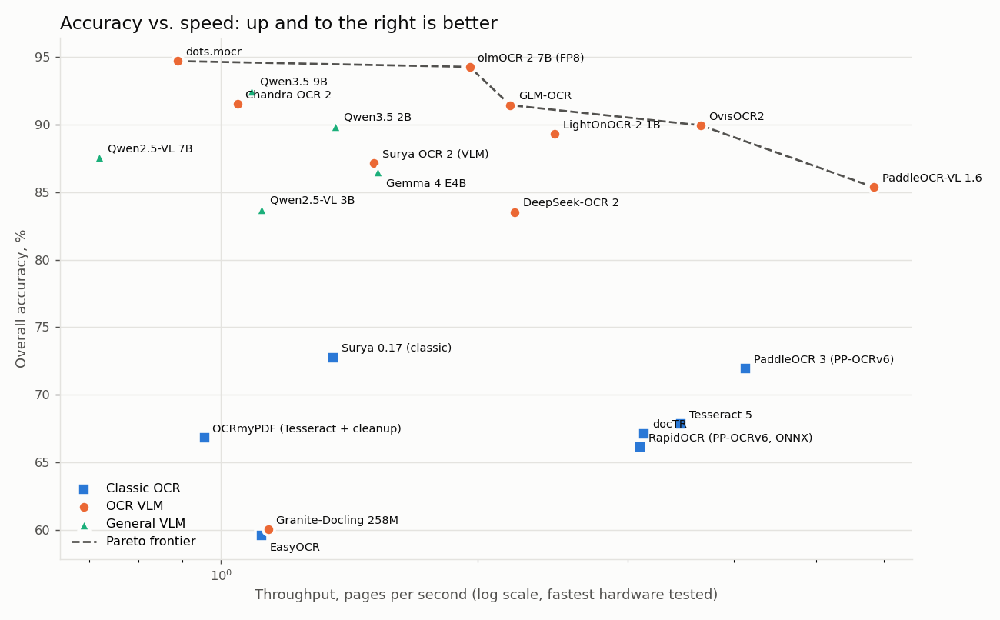
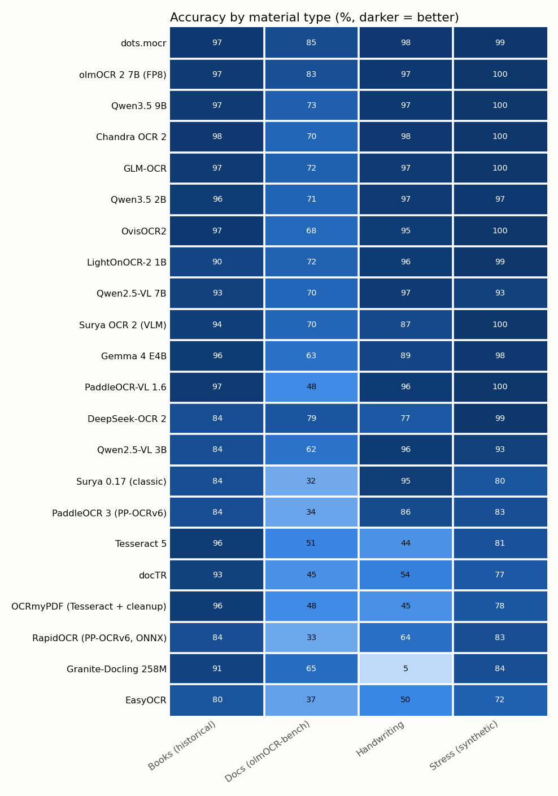
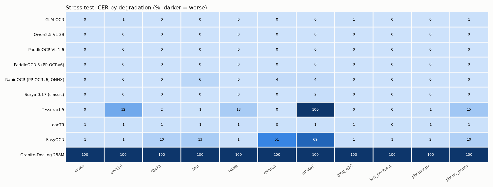

# OCR Leaderboard

Headline profile: **standard** · pages per track: Books (historical) 50, Docs (olmOCR-bench) 50, Handwriting 60, Stress (synthetic) 55 · hardware tested: A100-40GB, G4, L4, T4, TPU-v6e-1 · runs: 10

Generated by `python -m ocrbench report`. Scoring is described in [README](../README.md#how-scoring-works).

## Winners

| Category | Winner | Why |
| :--- | :--- | :--- |
| Most accurate overall | dots.mocr | 94.7% mean accuracy across the 4 tracks |
| Best on Books (historical) | Chandra OCR 2 | 98.0% char. accuracy (1 - CER) |
| Best on Docs (olmOCR-bench) | dots.mocr | 84.2% tests passed |
| Best on Handwriting | dots.mocr | 98.0% char. accuracy (1 - CER) |
| Best on Stress (synthetic) | Chandra OCR 2, olmOCR 2 7B (FP8), Qwen3.5 9B | 100.0% char. accuracy (1 - CER) |
| Fastest | PaddleOCR-VL 1.6 | 5.84 pages/s on G4 |
| Best value | OvisOCR2 | \$0.053 per 1k pages on L4 at 90.0% accuracy (cheapest within 5 points of the top score) |
| Cheapest at scale | PaddleOCR-VL 1.6 | \$0.029 per 1k pages (\$29 per 1M) on L4 |
| Best CPU-capable engine | Tesseract 5 | 67.8% mean accuracy, no GPU required |
| Most robust to bad scans | Qwen2.5-VL 7B | CER no higher on degraded scans than on clean ones (-3.5% on average) |
| Most reliable (fewest loops/empty pages) | dots.mocr, olmOCR 2 7B (FP8), Qwen3.5 9B (+7 more tied) | 0.0% of pages looped or came back empty |

## Overall leaderboard

Overall = mean of the four track accuracies (1 − CER for text tracks, test pass rate for docs). CER is in *reading* mode (ligatures, long-s and quote styles normalised; Markdown/HTML stripped). Speed and cost are for the fastest/cheapest Colab runtime tested; see the hardware table below.

| # | Engine | Type | Params | Overall ↑ | Books CER ↓ | Docs pass ↑ | Handwriting CER ↓ | Stress CER ↓ | Best pages/s ↑ | Min \$/1k pages ↓ | Loop rate ↓ |
| ---: | :--- | :--- | ---: | ---: | ---: | ---: | ---: | ---: | ---: | ---: | ---: |
| 1 | dots.mocr | OCR VLM | 3.04B | **94.7%** | 2.5% | **84.2%** | **2.0%** | 0.9% | 0.89 (G4) | \$0.236 | 0.0% |
| 2 | olmOCR 2 7B (FP8) | OCR VLM | 8.3B | 94.3% | 3.3% | 82.9% | 2.6% | 0.0% | 1.96 (G4) | \$0.118 | 0.0% |
| 3 | Qwen3.5 9B | General VLM | 9.65B | 92.5% | 3.2% | 76.0% | 2.7% | 0.0% | 1.09 (G4) | \$0.177 | 0.0% |
| 4 | Chandra OCR 2 | OCR VLM | 5.3B | 91.5% | **2.0%** | 70.3% | 2.3% | **0.0%** | 1.05 (G4) | \$0.187 | 0.0% |
| 5 | GLM-OCR | OCR VLM | 1.33B | 91.4% | 3.2% | 72.4% | 3.2% | 0.2% | 2.19 (G4) | \$0.100 | 0.0% |
| 6 | OvisOCR2 | OCR VLM | 0.85B | 90.0% | 2.7% | 67.6% | 4.7% | 0.5% | 3.66 (G4) | \$0.053 | 0.0% |
| 7 | Qwen3.5 2B | General VLM | 2.27B | 89.9% | 4.1% | 69.1% | 2.9% | 2.5% | 1.36 (G4) | \$0.146 | 1.3% |
| 8 | LightOnOCR-2 1B | OCR VLM | 1B | 89.3% | 10.3% | 71.8% | 3.7% | 0.5% | 2.46 (G4) | \$0.083 | 2.0% |
| 9 | Qwen2.5-VL 7B | General VLM | 8.29B | 87.6% | 6.9% | 67.5% | 3.5% | 6.8% | 0.72 (G4) | \$0.221 | 1.2% |
| 10 | Surya OCR 2 (VLM) | OCR VLM | 0.69B | 87.1% | 5.6% | 70.1% | 15.5% | 0.5% | 1.51 (G4) | \$0.123 | 1.9% |
| 11 | Gemma 4 E4B | General VLM | 8B | 86.5% | 3.8% | 63.0% | 10.8% | 2.4% | 1.53 (G4) | \$0.143 | 0.7% |
| 12 | PaddleOCR-VL 1.6 | OCR VLM | 0.96B | 85.4% | 3.0% | 48.8% | 4.2% | 0.1% | **5.84 (G4)** | **\$0.029** | 0.0% |
| 13 | Qwen2.5-VL 3B | General VLM | 3.75B | 83.7% | 17.3% | 64.5% | 4.4% | 7.9% | 1.12 (G4) | \$0.180 | 2.7% |
| 14 | DeepSeek-OCR 2 | OCR VLM | 3.39B | 83.5% | 17.1% | 78.9% | 26.4% | 1.3% | 2.21 (G4) | \$0.081 | 2.0% |
| 15 | Surya 0.17 (classic) | Classic OCR | – | 72.8% | 16.1% | 32.3% | 4.8% | 20.4% | 1.35 (G4) | \$0.128 | 0.0% |
| 16 | PaddleOCR 3 (PP-OCRv6) | Classic OCR | – | 71.9% | 15.7% | 34.1% | 14.1% | 16.5% | 4.13 (G4) | \$0.043 | 0.0% |
| 17 | Tesseract 5 | Classic OCR | – | 67.8% | 4.3% | 50.7% | 56.1% | 19.0% | 3.47 (G4) | \$0.049 | 0.0% |
| 18 | docTR | Classic OCR | – | 67.1% | 7.4% | 44.8% | 46.3% | 22.5% | 3.14 (G4) | \$0.062 | 0.0% |
| 19 | OCRmyPDF (Tesseract + cleanup) | Classic OCR | – | 66.8% | 4.3% | 48.3% | 55.0% | 21.6% | 0.96 (G4) | \$0.127 | 0.0% |
| 20 | RapidOCR (PP-OCRv6, ONNX) | Classic OCR | – | 66.2% | 16.3% | 33.4% | 35.8% | 16.7% | 3.10 (G4) | \$0.056 | 0.0% |
| 21 | Granite-Docling 258M | OCR VLM | 0.26B | 60.1% | 12.3% | 66.2% | 95.3% | 18.3% | 1.14 (G4) | \$0.081 | 3.8% |
| 22 | EasyOCR | Classic OCR | – | 59.6% | 20.0% | 36.6% | 50.5% | 27.6% | 1.11 (G4) | \$0.097 | 0.0% |

## Speed and cost by hardware

Cells: pages/s · \$ per 1,000 pages (Colab compute-unit pricing from `configs/hardware_costs.yaml`; TPU rates are unknown until you fill them in). Multiply \$/1k by 1,000 for the cost of a 1M-page collection.

| Engine | T4 | L4 | A100-40GB | G4 | TPU-v6e-1 |
| :--- | ---: | ---: | ---: | ---: | ---: |
| PaddleOCR-VL 1.6 | 0.60 · \$0.055 | 1.65 · \$0.029 | 2.69 · \$0.056 | 5.84 · \$0.041 | – |
| PaddleOCR 3 (PP-OCRv6) | 0.72 · \$0.046 | 1.10 · \$0.043 | 1.39 · \$0.108 | 4.13 · \$0.059 | – |
| OvisOCR2 | 0.21 · \$0.155 | 0.89 · \$0.053 | 2.05 · \$0.073 | 3.66 · \$0.066 | – |
| Tesseract 5 | 0.68 · \$0.049 | 0.82 · \$0.058 | 0.81 · \$0.184 | 3.47 · \$0.070 | 2.28 · \$0.050 |
| docTR | 0.51 · \$0.065 | 0.77 · \$0.062 | 1.03 · \$0.146 | 3.14 · \$0.077 | – |
| RapidOCR (PP-OCRv6, ONNX) | 0.46 · \$0.071 | 0.62 · \$0.076 | 0.63 · \$0.239 | 3.10 · \$0.078 | 2.03 · \$0.056 |
| LightOnOCR-2 1B | 0.07 · \$0.452 | 0.57 · \$0.083 | 1.68 · \$0.089 | 2.46 · \$0.098 | – |
| DeepSeek-OCR 2 | 0.01 · \$2.306 | 0.59 · \$0.081 | 1.66 · \$0.090 | 2.21 · \$0.109 | – |
| GLM-OCR | 0.09 · \$0.364 | 0.43 · \$0.110 | 1.50 · \$0.100 | 2.19 · \$0.111 | – |
| olmOCR 2 7B (FP8) | – | 0.40 · \$0.118 | 1.19 · \$0.126 | 1.96 · \$0.123 | – |
| Gemma 4 E4B | – | 0.33 · \$0.143 | 0.88 · \$0.171 | 1.53 · \$0.158 | – |
| Surya OCR 2 (VLM) | 0.12 · \$0.284 | 0.39 · \$0.123 | 0.92 · \$0.162 | 1.51 · \$0.160 | – |
| Qwen3.5 2B | 0.13 · \$0.255 | 0.31 · \$0.155 | 1.03 · \$0.146 | 1.36 · \$0.178 | – |
| Surya 0.17 (classic) | 0.25 · \$0.131 | 0.37 · \$0.128 | 0.66 · \$0.227 | 1.35 · \$0.179 | – |
| Granite-Docling 258M | 0.20 · \$0.163 | 0.59 · \$0.081 | 0.74 · \$0.202 | 1.14 · \$0.213 | – |
| Qwen2.5-VL 3B | 0.13 · \$0.246 | 0.24 · \$0.195 | 0.83 · \$0.180 | 1.12 · \$0.217 | – |
| EasyOCR | 0.34 · \$0.097 | 0.45 · \$0.106 | 0.49 · \$0.304 | 1.11 · \$0.217 | – |
| Qwen3.5 9B | – | – | 0.85 · \$0.177 | 1.09 · \$0.223 | – |
| Chandra OCR 2 | – | 0.22 · \$0.214 | 0.80 · \$0.187 | 1.05 · \$0.231 | – |
| OCRmyPDF (Tesseract + cleanup) | 0.26 · \$0.127 | 0.30 · \$0.156 | 0.26 · \$0.585 | 0.96 · \$0.253 | 0.70 · \$0.163 |
| dots.mocr | 0.01 · \$3.334 | 0.18 · \$0.264 | 0.63 · \$0.236 | 0.89 · \$0.272 | – |
| Qwen2.5-VL 7B | – | 0.14 · \$0.336 | 0.68 · \$0.221 | 0.72 · \$0.336 | – |

## Robustness ladder (synthetic stress track, CER)

Same pages, progressively degraded. `degradation` = mean CER over degraded levels minus clean CER.

| Engine | clean | dpi150 | dpi75 | blur | noise | rotate3 | rotate8 | jpeg_q10 | low_contrast | photocopy | phone_photo | degradation |
| :--- | ---: | ---: | ---: | ---: | ---: | ---: | ---: | ---: | ---: | ---: | ---: | ---: |
| Chandra OCR 2 | 0.0% | 0.0% | 0.0% | 0.0% | 0.0% | 0.0% | 0.0% | 0.0% | 0.0% | 0.0% | 0.0% | 0.0% |
| dots.mocr | 0.0% | 0.0% | 0.2% | 0.0% | 0.0% | 0.0% | 9.4% | 0.0% | 0.0% | 0.0% | 0.0% | 1.0% |
| GLM-OCR | 0.0% | 0.2% | 2.0% | 0.0% | 0.0% | 0.0% | 0.0% | 0.2% | 0.0% | 0.0% | 0.2% | 0.3% |
| LightOnOCR-2 1B | 0.0% | 0.0% | 0.0% | 0.0% | 0.0% | 0.0% | 5.9% | 0.0% | 0.0% | 0.0% | 0.0% | 0.6% |
| olmOCR 2 7B (FP8) | 0.0% | 0.0% | 0.0% | 0.0% | 0.0% | 0.0% | 0.0% | 0.0% | 0.0% | 0.0% | 0.0% | 0.0% |
| OvisOCR2 | 0.0% | 0.0% | 0.0% | 0.0% | 0.0% | 0.0% | 5.3% | 0.0% | 0.0% | 0.0% | 0.0% | 0.5% |
| Qwen3.5 9B | 0.0% | 0.0% | 0.0% | 0.0% | 0.0% | 0.0% | 0.0% | 0.0% | 0.0% | 0.0% | 0.0% | 0.0% |
| Qwen3.5 2B | 0.0% | 2.0% | 20.0% | 0.0% | 0.0% | 2.0% | 0.0% | 0.0% | 0.0% | 2.0% | 2.0% | 2.8% |
| Surya OCR 2 (VLM) | 0.0% | 0.0% | 0.0% | 0.0% | 0.0% | 0.0% | 5.3% | 0.0% | 0.0% | 0.0% | 0.0% | 0.5% |
| PaddleOCR-VL 1.6 | 0.0% | 0.0% | 0.0% | 0.0% | 0.0% | 0.5% | 0.5% | 0.0% | 0.0% | 0.0% | 0.0% | 0.1% |
| OCRmyPDF (Tesseract + cleanup) | 0.1% | 0.2% | 37.2% | 6.2% | 49.9% | 0.1% | 77.7% | 0.6% | 0.1% | 20.5% | 44.8% | 23.6% |
| Tesseract 5 | 0.1% | 6.4% | 4.4% | 6.4% | 55.5% | 0.3% | 81.9% | 0.4% | 0.1% | 18.8% | 34.4% | 20.7% |
| DeepSeek-OCR 2 | 0.1% | 0.0% | 0.0% | 0.0% | 0.0% | 11.6% | 3.0% | 0.0% | 0.0% | 0.0% | 0.0% | 1.3% |
| Gemma 4 E4B | 0.8% | 0.8% | 0.8% | 0.9% | 0.8% | 4.6% | 14.9% | 0.0% | 0.8% | 0.8% | 0.8% | 1.7% |
| Qwen2.5-VL 3B | 6.3% | 6.2% | 15.8% | 6.2% | 8.3% | 7.2% | 8.2% | 6.2% | 8.3% | 6.2% | 8.2% | 1.8% |
| Qwen2.5-VL 7B | 10.0% | 10.0% | 0.0% | 5.1% | 10.0% | 0.0% | 7.0% | 17.8% | 0.0% | 15.0% | 0.0% | -3.5% |
| Granite-Docling 258M | 11.3% | 29.4% | 11.3% | 17.0% | 11.3% | 65.5% | 22.1% | 11.3% | 0.1% | 2.1% | 20.3% | 7.7% |
| RapidOCR (PP-OCRv6, ONNX) | 12.9% | 13.2% | 13.6% | 14.2% | 13.2% | 25.8% | 24.8% | 13.0% | 13.2% | 15.5% | 24.0% | 4.2% |
| PaddleOCR 3 (PP-OCRv6) | 13.2% | 13.2% | 13.4% | 13.2% | 13.2% | 25.9% | 24.8% | 13.2% | 13.2% | 13.4% | 25.0% | 3.7% |
| EasyOCR | 13.3% | 17.9% | 26.3% | 40.2% | 11.9% | 49.5% | 68.4% | 16.6% | 9.7% | 19.4% | 30.5% | 15.8% |
| Surya 0.17 (classic) | 18.9% | 16.0% | 16.6% | 17.2% | 21.0% | 26.5% | 26.5% | 15.8% | 20.1% | 19.3% | 26.3% | 1.6% |
| docTR | 22.6% | 22.4% | 22.6% | 22.7% | 22.8% | 22.4% | 22.5% | 22.4% | 22.5% | 22.5% | 22.4% | -0.1% |

## Historical books by language (CER)

| Engine | de | en | fr | fr+de | la |
| :--- | ---: | ---: | ---: | ---: | ---: |
| Gemma 4 E4B | 0.3% | 2.1% | 2.4% | 0.9% | 15.6% |
| Surya 0.17 (classic) | 0.3% | 37.5% | 1.1% | 0.6% | 14.3% |
| Surya OCR 2 (VLM) | 0.4% | 1.0% | 0.9% | 0.2% | 31.0% |
| Tesseract 5 | 0.4% | 3.7% | 2.1% | 3.0% | 13.1% |
| PaddleOCR-VL 1.6 | 0.4% | 2.0% | 1.5% | 0.5% | 12.1% |
| dots.mocr | 0.5% | 1.3% | 3.0% | 0.9% | 8.5% |
| OCRmyPDF (Tesseract + cleanup) | 0.5% | 3.6% | 2.1% | 3.2% | 13.2% |
| GLM-OCR | 0.6% | 3.0% | 3.0% | 0.9% | 8.9% |
| olmOCR 2 7B (FP8) | 0.6% | 2.6% | 3.3% | 0.9% | 9.7% |
| LightOnOCR-2 1B | 0.6% | 1.4% | 2.5% | 2.1% | 55.7% |
| OvisOCR2 | 0.7% | 1.1% | 1.7% | 1.1% | 10.7% |
| Qwen3.5 2B | 1.2% | 4.6% | 2.1% | 2.9% | 9.0% |
| Qwen3.5 9B | 1.3% | 1.9% | 2.1% | 2.3% | 9.7% |
| Chandra OCR 2 | 1.3% | 0.3% | 1.1% | 0.3% | 9.0% |
| Qwen2.5-VL 7B | 1.3% | 3.8% | 1.2% | 0.8% | 31.4% |
| PaddleOCR 3 (PP-OCRv6) | 1.8% | 37.2% | 1.3% | 1.1% | 10.5% |
| RapidOCR (PP-OCRv6, ONNX) | 1.8% | 38.1% | 1.8% | 1.7% | 10.8% |
| docTR | 2.1% | 10.4% | 2.2% | 2.7% | 16.0% |
| Granite-Docling 258M | 2.4% | 15.6% | 4.1% | 2.6% | 33.0% |
| DeepSeek-OCR 2 | 2.6% | 28.5% | 5.0% | 2.3% | 33.0% |
| EasyOCR | 3.8% | 39.5% | 5.8% | 4.7% | 22.0% |
| Qwen2.5-VL 3B | 23.3% | 21.3% | 13.8% | 1.5% | 21.9% |

## Modern documents by olmOCR-bench category (pass rate)

| Engine | baseline | headers_footers | long_tiny_text | multi_column | old_scans | table_tests |
| :--- | ---: | ---: | ---: | ---: | ---: | ---: |
| OCRmyPDF (Tesseract + cleanup) | 94.0% | 50.0% | 73.6% | 58.8% | 13.5% | 0.0% |
| OvisOCR2 | 94.0% | 13.6% | 96.5% | 91.2% | 23.1% | 87.2% |
| PaddleOCR-VL 1.6 | 94.0% | 22.7% | 88.5% | 64.7% | 23.1% | 0.0% |
| Granite-Docling 258M | 94.0% | 95.5% | 73.6% | 67.7% | 15.4% | 51.1% |
| Qwen2.5-VL 7B | 96.0% | 59.1% | 81.6% | 70.6% | 21.1% | 76.6% |
| GLM-OCR | 98.0% | 100.0% | 94.2% | 85.3% | 25.0% | 31.9% |
| Tesseract 5 | 98.0% | 40.9% | 79.3% | 70.6% | 15.4% | 0.0% |
| RapidOCR (PP-OCRv6, ONNX) | 98.0% | 22.7% | 58.6% | 5.9% | 15.4% | 0.0% |
| Surya OCR 2 (VLM) | 98.0% | 40.9% | 88.5% | 73.5% | 32.7% | 87.2% |
| Qwen3.5 2B | 98.0% | 27.3% | 94.2% | 88.2% | 34.6% | 72.3% |
| Qwen2.5-VL 3B | 98.0% | 68.2% | 74.7% | 58.8% | 17.3% | 70.2% |
| PaddleOCR 3 (PP-OCRv6) | 98.0% | 27.3% | 62.1% | 5.9% | 11.5% | 0.0% |
| dots.mocr | 100.0% | 95.5% | 97.7% | 88.2% | 36.5% | 87.2% |
| docTR | 100.0% | 50.0% | 57.5% | 44.1% | 17.3% | 0.0% |
| DeepSeek-OCR 2 | 100.0% | 95.5% | 94.2% | 85.3% | 13.5% | 85.1% |
| Chandra OCR 2 | 100.0% | 31.8% | 95.4% | 76.5% | 30.8% | 87.2% |
| LightOnOCR-2 1B | 100.0% | 18.2% | 97.7% | 91.2% | 36.5% | 87.2% |
| olmOCR 2 7B (FP8) | 100.0% | 95.5% | 93.1% | 85.3% | 36.5% | 87.2% |
| Gemma 4 E4B | 100.0% | 13.6% | 79.3% | 76.5% | 36.5% | 72.3% |
| EasyOCR | 100.0% | 45.5% | 32.2% | 32.4% | 9.6% | 0.0% |
| Qwen3.5 9B | 100.0% | 50.0% | 96.5% | 91.2% | 30.8% | 87.2% |
| Surya 0.17 (classic) | 100.0% | 9.1% | 59.8% | 5.9% | 19.2% | 0.0% |

## Reliability

| Engine | Loop rate | Empty pages | Over-extraction |
| :--- | ---: | ---: | ---: |
| dots.mocr | 0.0% | 0.0% | 2.9% |
| olmOCR 2 7B (FP8) | 0.0% | 0.0% | 4.1% |
| Qwen3.5 9B | 0.0% | 0.0% | 4.0% |
| Chandra OCR 2 | 0.0% | 0.0% | 3.5% |
| GLM-OCR | 0.0% | 0.0% | 3.6% |
| OvisOCR2 | 0.0% | 0.0% | 6.3% |
| Qwen3.5 2B | 1.3% | 0.0% | 5.0% |
| LightOnOCR-2 1B | 2.0% | 0.0% | 6.5% |
| Qwen2.5-VL 7B | 1.2% | 0.5% | 5.6% |
| Surya OCR 2 (VLM) | 1.9% | 0.4% | 6.8% |
| Gemma 4 E4B | 0.7% | 0.0% | 6.9% |
| PaddleOCR-VL 1.6 | 0.0% | 0.0% | 6.3% |
| Qwen2.5-VL 3B | 2.7% | 0.5% | 6.5% |
| DeepSeek-OCR 2 | 2.0% | 1.7% | 15.9% |
| Surya 0.17 (classic) | 0.0% | 0.0% | 5.5% |
| PaddleOCR 3 (PP-OCRv6) | 0.0% | 0.0% | 12.6% |
| Tesseract 5 | 0.0% | 5.7% | 28.8% |
| docTR | 0.0% | 0.4% | 28.7% |
| OCRmyPDF (Tesseract + cleanup) | 0.0% | 6.7% | 29.2% |
| RapidOCR (PP-OCRv6, ONNX) | 0.0% | 2.5% | 18.1% |
| Granite-Docling 258M | 3.8% | 25.8% | 6.1% |
| EasyOCR | 0.0% | 0.0% | 40.1% |

## Skipped and failed engines

| Hardware | Engine | Status | Reason |
| :--- | :--- | :--- | :--- |
| TPU-v6e-1 | EasyOCR | skipped | unsupported_hardware: needs cpu/gpu |
| TPU-v6e-1 | docTR | skipped | unsupported_hardware: needs cpu/gpu |
| TPU-v6e-1 | PaddleOCR 3 (PP-OCRv6) | skipped | unsupported_hardware: needs gpu |
| TPU-v6e-1 | Surya 0.17 (classic) | skipped | unsupported_hardware: needs gpu |
| TPU-v6e-1 | PaddleOCR-VL 1.6 | skipped | unsupported_hardware: needs gpu |
| TPU-v6e-1 | OvisOCR2 | skipped | unsupported_hardware: needs gpu |
| TPU-v6e-1 | LightOnOCR-2 1B | skipped | unsupported_hardware: needs gpu |
| TPU-v6e-1 | GLM-OCR | skipped | unsupported_hardware: needs gpu |
| TPU-v6e-1 | Granite-Docling 258M | skipped | unsupported_hardware: needs gpu |
| TPU-v6e-1 | dots.mocr | skipped | unsupported_hardware: needs gpu |
| TPU-v6e-1 | DeepSeek-OCR 2 | skipped | unsupported_hardware: needs gpu |
| TPU-v6e-1 | Chandra OCR 2 | skipped | unsupported_hardware: needs gpu |
| TPU-v6e-1 | Surya OCR 2 (VLM) | skipped | unsupported_hardware: needs gpu |
| TPU-v6e-1 | olmOCR 2 7B (FP8) | skipped | unsupported_hardware: needs gpu |
| TPU-v6e-1 | Qwen3.5 2B | skipped | unsupported_hardware: needs gpu |
| TPU-v6e-1 | Qwen3.5 9B | skipped | unsupported_hardware: needs gpu |
| TPU-v6e-1 | Gemma 4 E4B | skipped | unsupported_hardware: needs gpu |
| L4 | Qwen3.5 9B | skipped | insufficient_vram: needs 30 GB, have 22.5 |
| T4 | Chandra OCR 2 | skipped | insufficient_vram: needs 20 GB, have 15.0 |
| T4 | olmOCR 2 7B (FP8) | skipped | insufficient_vram: needs 20 GB, have 15.0 |
| T4 | Qwen3.5 9B | skipped | insufficient_vram: needs 30 GB, have 15.0 |
| T4 | Gemma 4 E4B | skipped | insufficient_vram: needs 22 GB, have 15.0 |
| T4 | Qwen2.5-VL 7B | skipped | insufficient_vram: needs 22 GB, have 15.0 |
| L4 | Chandra OCR 2 | partial | time budget ran out: 197 of 215 pages scored |
| T4 | DeepSeek-OCR 2 | partial | time budget ran out: 64 of 215 pages scored |
| T4 | dots.mocr | partial | time budget ran out: 36 of 215 pages scored |
| A100-40GB | OCRmyPDF (Tesseract + cleanup) | partial | RuntimeError: ocrmypdf exit 7: 
    1 [tesseract] Error during processing.

SubprocessOutputError
 |
| TPU-v6e-1 | Qwen2.5-VL 3B | error | env install failed: command failed (1): /usr/local/bin/uv pip install --python /content/ocrbench_envs/vllm-tpu/bin/python vllm-tpu==0.30.0 . |
| L4 | Qwen2.5-VL 7B | partial | time budget ran out: 195 of 215 pages scored |
| TPU-v6e-1 | Qwen2.5-VL 7B | error | env install failed: command failed (1): /usr/local/bin/uv pip install --python /content/ocrbench_envs/vllm-tpu/bin/python vllm-tpu==0.30.0 . |
